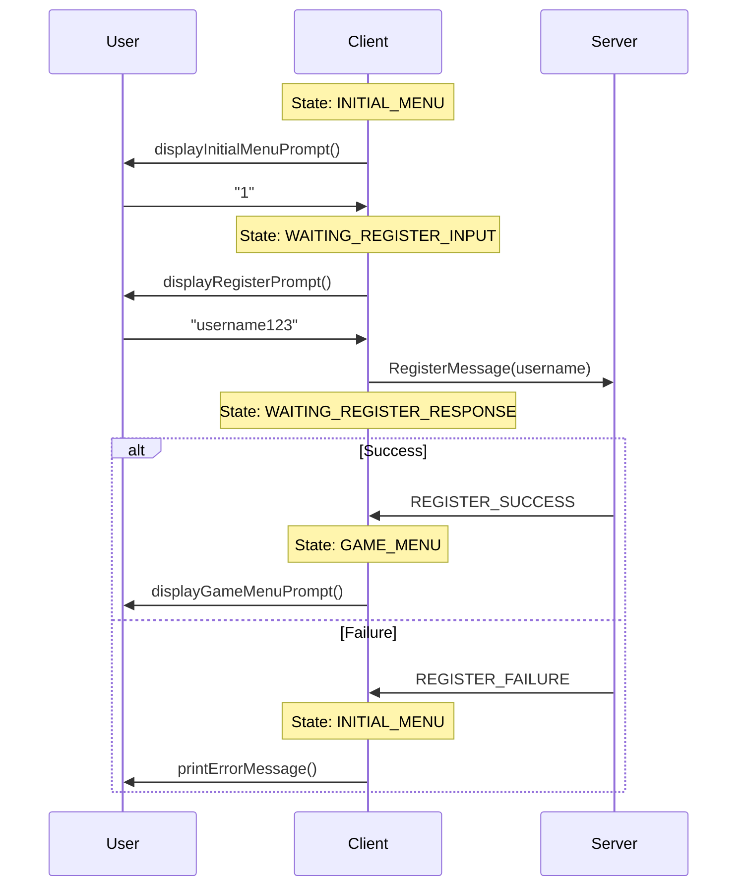
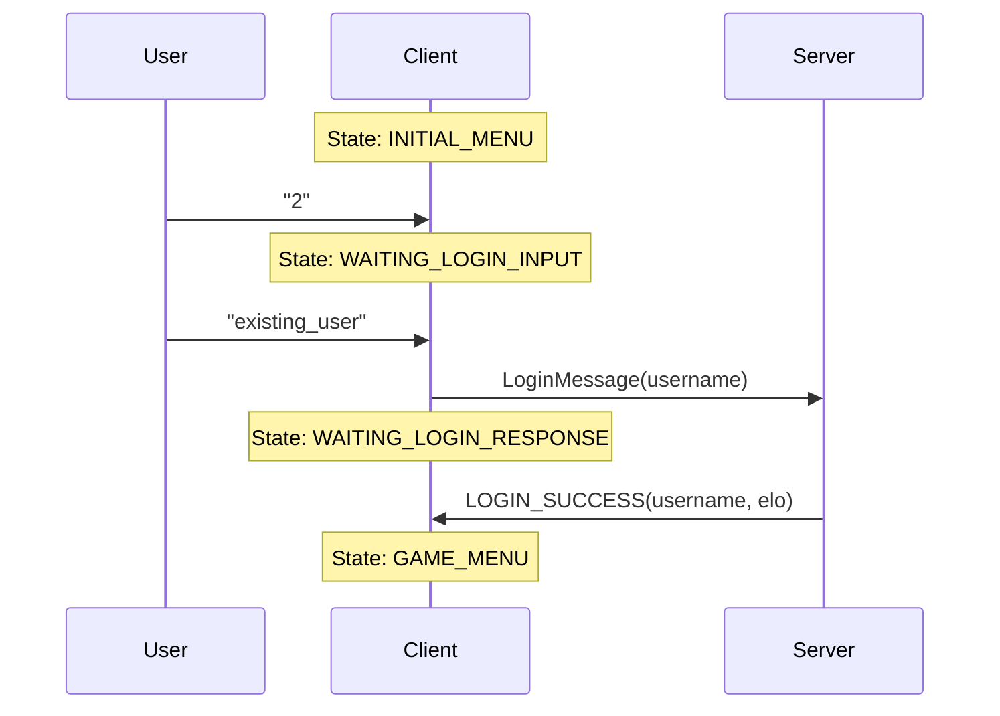
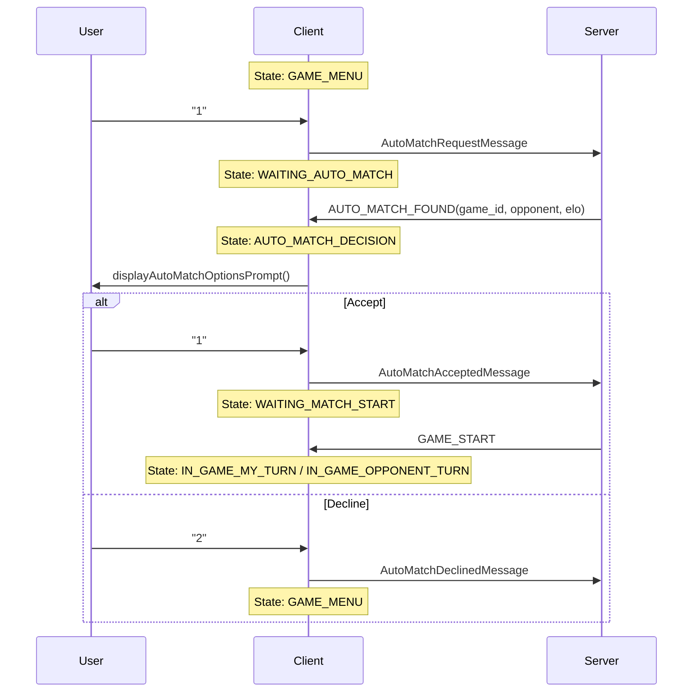
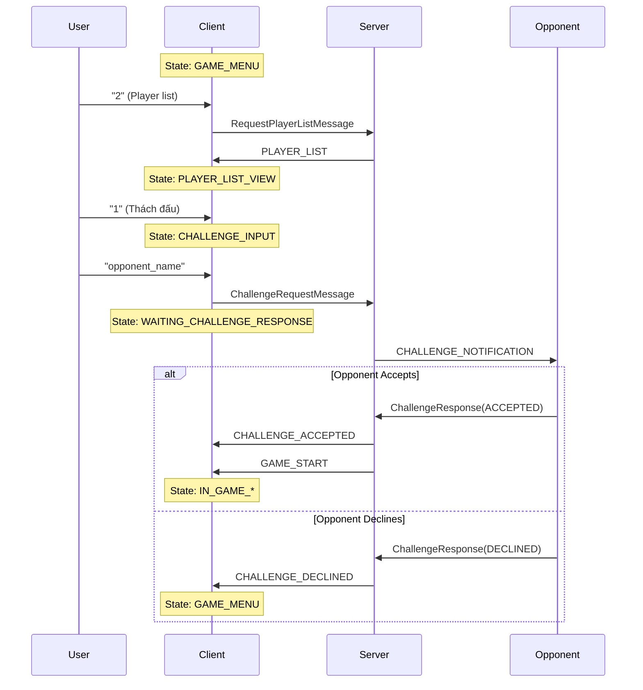
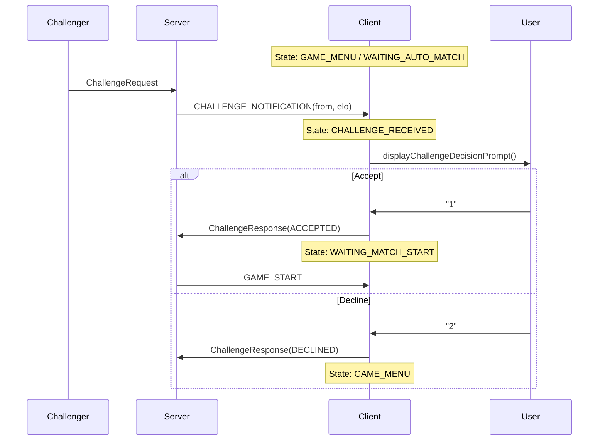
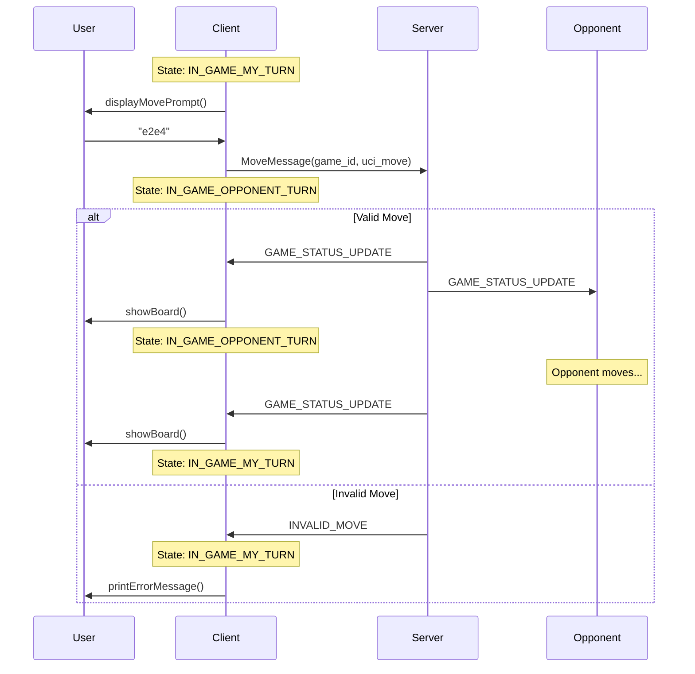
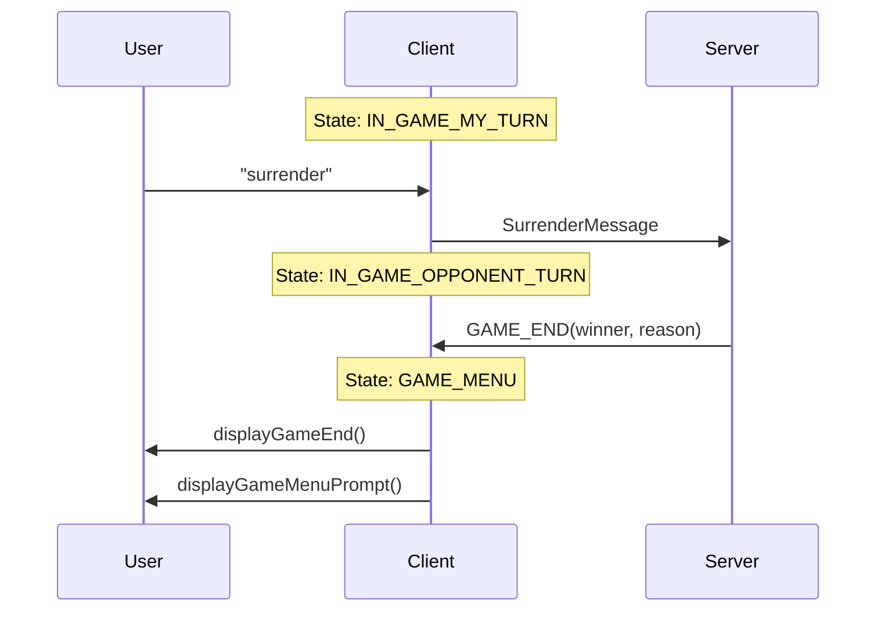
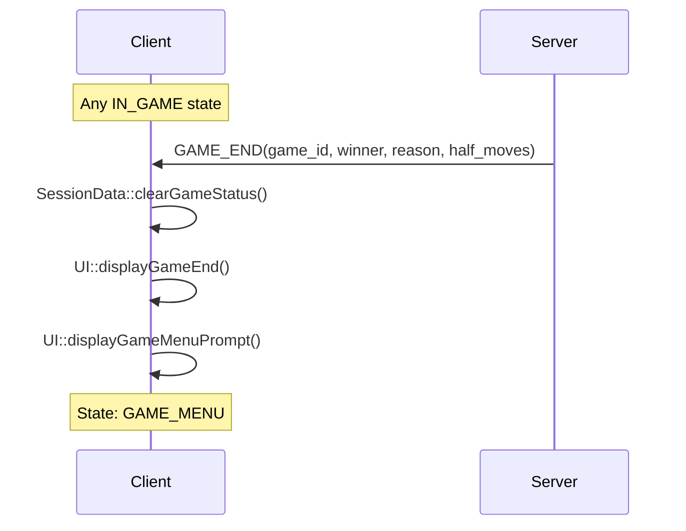

# Chess TCP Client - Tài Liệu Chi Tiết

## Mục Lục
1. [Tổng Quan Kiến Trúc](#1-tổng-quan-kiến-trúc)
2. [State Machine](#2-state-machine)
3. [Files Và Components](#3-files-và-components)
4. [Event Loop](#4-event-loop)
5. [Flow Chi Tiết Các Tính Năng](#5-flow-chi-tiết-các-tính-năng)
6. [Danh Sách Hàm](#6-danh-sách-hàm)

---

## 1. Tổng Quan Kiến Trúc

### Single-Thread Event Loop Architecture


### Đặc điểm chính

| Đặc điểm | Mô tả |
|----------|-------|
| **Threading** | Single-threaded với `select()` |
| **Pattern** | State Machine |
| **I/O Model** | Non-blocking |
| **Terminal** | Raw mode (không cần Enter để nhận input) |

---

## 2. State Machine

### 2.1 Các State


### 2.2 Bảng State

| State | Mô tả | Chờ Input? | Chờ Server? |
|-------|-------|------------|-------------|
| `INITIAL_MENU` | Menu đăng ký/đăng nhập | ✓ | |
| `WAITING_REGISTER_INPUT` | Chờ nhập username đăng ký | ✓ | |
| `WAITING_LOGIN_INPUT` | Chờ nhập username đăng nhập | ✓ | |
| `WAITING_REGISTER_RESPONSE` | Chờ server xác nhận đăng ký | | ✓ |
| `WAITING_LOGIN_RESPONSE` | Chờ server xác nhận đăng nhập | | ✓ |
| `GAME_MENU` | Menu chính | ✓ | |
| `WAITING_AUTO_MATCH` | Đang tìm đối thủ | | ✓ |
| `AUTO_MATCH_DECISION` | Tìm thấy, chờ accept/decline | ✓ | |
| `WAITING_MATCH_START` | Đã accept, chờ game start | | ✓ |
| `WAITING_PLAYER_LIST` | Chờ danh sách player | | ✓ |
| `PLAYER_LIST_VIEW` | Xem danh sách, chọn action | ✓ | |
| `CHALLENGE_INPUT` | Nhập username thách đấu | ✓ | |
| `WAITING_CHALLENGE_RESPONSE` | Chờ opponent phản hồi | | ✓ |
| `CHALLENGE_RECEIVED` | Nhận thách đấu, chờ quyết định | ✓ | |
| `IN_GAME_MY_TURN` | Đang chơi, lượt của mình | ✓ | |
| `IN_GAME_OPPONENT_TURN` | Đang chơi, lượt đối thủ | | ✓ |
| `EXITING` | Đang thoát | | |

---

## 3. Files Và Components

### 3.1 Cấu trúc thư mục

```
client/
├── client_main.cpp       # Entry point, event loop
├── client_state.hpp      # State enum và StateContext
├── input_processor.hpp   # Xử lý user input
├── message_handler.hpp   # Xử lý server message
├── session_data.hpp      # User session data
├── network_client.hpp    # TCP socket handling
├── ui.hpp                # Console display
└── board_display.hpp     # Chess board rendering
```

### 3.2 Component Diagram


### 3.3 Chi tiết từng file

#### `client_state.hpp`
```cpp
// State machine states
enum class ClientState {
    INITIAL_MENU,
    WAITING_REGISTER_INPUT,
    WAITING_LOGIN_INPUT,
    WAITING_REGISTER_RESPONSE,
    WAITING_LOGIN_RESPONSE,
    GAME_MENU,
    WAITING_AUTO_MATCH,
    AUTO_MATCH_DECISION,
    WAITING_MATCH_START,
    WAITING_PLAYER_LIST,
    PLAYER_LIST_VIEW,
    CHALLENGE_INPUT,
    WAITING_CHALLENGE_RESPONSE,
    CHALLENGE_RECEIVED,
    IN_GAME_MY_TURN,
    IN_GAME_OPPONENT_TURN,
    EXITING
};

// Context data giữa các state
struct StateContext {
    std::string pending_game_id;
    std::string opponent_username;
    uint16_t opponent_elo;
    std::string challenger_username;
    uint16_t challenger_elo;
    std::vector<PlayerListMessage::Player> player_list_cache;
    int timeout_counter;
};
```

#### `client_main.cpp`
```cpp
// Event loop với select() - chỉ dùng state để kiểm soát
while (currentState != ClientState::EXITING) {
    fd_set read_fds;
    FD_SET(STDIN_FILENO, &read_fds);
    FD_SET(socket_fd, &read_fds);
    
    select(max_fd + 1, &read_fds, NULL, NULL, &timeout);
    
    if (FD_ISSET(STDIN_FILENO, &read_fds)) {
        // Process user input
        currentState = inputProcessor.processInput(currentState, input, context);
    }
    
    if (FD_ISSET(socket_fd, &read_fds)) {
        // Process server message
        if (network.receivePacket(packet)) {
            currentState = messageHandler.handleMessage(currentState, packet, context);
        } else {
            currentState = ClientState::EXITING;  // Disconnect
        }
    }
}
```

---

## 4. Event Loop

### 4.1 Flow tổng quan


### 4.2 Non-blocking I/O

```cpp
// Set stdin non-blocking
fcntl(STDIN_FILENO, F_SETFL, O_NONBLOCK);

// Raw terminal mode (không cần nhấn Enter)
struct termios new_tio;
new_tio.c_lflag &= (~ICANON);
new_tio.c_cc[VMIN] = 0;
new_tio.c_cc[VTIME] = 0;
tcsetattr(STDIN_FILENO, TCSANOW, &new_tio);
```

---

## 5. Flow Chi Tiết Các Tính Năng

### 5.1 Đăng Ký (Register)



**Code Flow:**
```
main() → select() → STDIN ready
  → InputProcessor::processInput(INITIAL_MENU, "1")
    → processInitialMenu("1")
      → return WAITING_REGISTER_INPUT
  
main() → select() → STDIN ready
  → InputProcessor::processInput(WAITING_REGISTER_INPUT, "username123")
    → processRegisterInput("username123")
      → NetworkClient::sendPacket(REGISTER, payload)
      → return WAITING_REGISTER_RESPONSE

main() → select() → SOCKET ready
  → MessageHandler::handleMessage(WAITING_REGISTER_RESPONSE, packet)
    → handleRegisterSuccess(payload)
      → SessionData::setUsername()
      → SessionData::setElo()
      → UI::displayGameMenuPrompt()
      → return GAME_MENU
```

### 5.2 Đăng Nhập (Login)



### 5.3 Auto Match



**Code Flow:**
```
InputProcessor::processGameMenu("1")
  → AutoMatchRequestMessage::serialize()
  → NetworkClient::sendPacket(AUTO_MATCH_REQUEST)
  → UI::displayWaitingAutoMatch()
  → return WAITING_AUTO_MATCH

MessageHandler::handleAutoMatchFound(payload)
  → context.pending_game_id = message.game_id
  → context.opponent_username = message.opponent_username
  → context.opponent_elo = message.opponent_elo
  → UI::displayAutoMatchOptionsPrompt()
  → return AUTO_MATCH_DECISION

InputProcessor::processAutoMatchDecision("1")
  → AutoMatchAcceptedMessage::serialize()
  → NetworkClient::sendPacket(AUTO_MATCH_ACCEPTED)
  → return WAITING_MATCH_START

MessageHandler::handleGameStart(payload)
  → SessionData::setGameStatus()
  → UI::showBoard()
  → return IN_GAME_MY_TURN / IN_GAME_OPPONENT_TURN
```

### 5.4 Challenge



### 5.5 Nhận Challenge



### 5.6 Gameplay (Move)



**Code Flow:**
```
InputProcessor::processGameMove("e2e4")
  → MoveMessage{game_id, "e2e4"}.serialize()
  → NetworkClient::sendPacket(MOVE)
  → return IN_GAME_OPPONENT_TURN

MessageHandler::handleGameStatusUpdate(payload)
  → SessionData::setFen(message.fen)
  → SessionData::setTurn(is_my_turn)
  → UI::showBoard(fen, flip)
  → if (is_my_turn)
      → UI::displayMovePrompt()
      → return IN_GAME_MY_TURN
    else
      → UI::displayWaitingOpponentMove()
      → return IN_GAME_OPPONENT_TURN
```

### 5.7 Surrender



### 5.8 Game End



---

## 6. Danh Sách Hàm

### 6.1 InputProcessor

| Hàm | Input | Output | Mô tả |
|-----|-------|--------|-------|
| `processInput()` | state, input, context | ClientState | Entry point xử lý input |
| `processInitialMenu()` | input | ClientState | Xử lý menu ban đầu |
| `processRegisterInput()` | input | ClientState | Gửi register request |
| `processLoginInput()` | input | ClientState | Gửi login request |
| `processGameMenu()` | input | ClientState | Xử lý game menu |
| `processAutoMatchDecision()` | input, context | ClientState | Accept/decline match |
| `processPlayerListView()` | input, context | ClientState | Xử lý player list |
| `processChallengeInput()` | input, context | ClientState | Gửi challenge |
| `processChallengeReceived()` | input, context | ClientState | Phản hồi challenge |
| `processGameMove()` | input | ClientState | Gửi nước đi |

### 6.2 MessageHandler

| Hàm | MessageType | Output | Mô tả |
|-----|-------------|--------|-------|
| `handleMessage()` | packet | ClientState | Entry point xử lý message |
| `handleRegisterSuccess()` | REGISTER_SUCCESS | GAME_MENU | Đăng ký thành công |
| `handleRegisterFailure()` | REGISTER_FAILURE | INITIAL_MENU | Đăng ký thất bại |
| `handleLoginSuccess()` | LOGIN_SUCCESS | GAME_MENU | Đăng nhập thành công |
| `handleLoginFailure()` | LOGIN_FAILURE | INITIAL_MENU | Đăng nhập thất bại |
| `handleGameStart()` | GAME_START | IN_GAME_* | Bắt đầu game |
| `handleGameStatusUpdate()` | GAME_STATUS_UPDATE | IN_GAME_* | Cập nhật board |
| `handleInvalidMove()` | INVALID_MOVE | IN_GAME_MY_TURN | Nước đi sai |
| `handleGameEnd()` | GAME_END | GAME_MENU | Kết thúc game |
| `handleAutoMatchFound()` | AUTO_MATCH_FOUND | AUTO_MATCH_DECISION | Tìm thấy match |
| `handleMatchDeclinedNotification()` | MATCH_DECLINED_NOTIFICATION | GAME_MENU | Đối thủ decline |
| `handlePlayerList()` | PLAYER_LIST | PLAYER_LIST_VIEW | Nhận danh sách |
| `handleChallengeNotification()` | CHALLENGE_NOTIFICATION | CHALLENGE_RECEIVED | Nhận challenge |
| `handleChallengeDeclined()` | CHALLENGE_DECLINED | GAME_MENU | Bị từ chối |
| `handleChallengeAccepted()` | CHALLENGE_ACCEPTED | WAITING_MATCH_START | Được chấp nhận |
| `handleChallengeError()` | CHALLENGE_ERROR | GAME_MENU | Lỗi challenge |

### 6.3 NetworkClient

| Hàm | Mô tả |
|-----|-------|
| `getInstance()` | Singleton instance |
| `getSocketFd()` | Lấy socket fd cho select() |
| `sendPacket(type, payload)` | Gửi packet đến server |
| `receivePacket(packet)` | Nhận packet từ server |
| `closeConnection()` | Đóng kết nối |

### 6.4 SessionData

| Hàm | Mô tả |
|-----|-------|
| `getInstance()` | Singleton instance |
| `getUsername()` / `setUsername()` | Username hiện tại |
| `getElo()` / `setElo()` | ELO hiện tại |
| `getGameId()` | ID game đang chơi |
| `setGameStatus()` | Set game_id, is_white, fen |
| `clearGameStatus()` | Clear khi game end |
| `isMyTurn()` / `setTurn()` | Lượt chơi |
| `isWhite()` | Là quân trắng? |
| `getFen()` / `setFen()` | FEN string |
| `isInGame()` | Đang trong game? |

### 6.5 UI

| Hàm | Mô tả |
|-----|-------|
| `clearConsole()` | Xóa màn hình |
| `printLogo()` | In logo TCP Chess |
| `printErrorMessage()` | In message đỏ |
| `printSuccessMessage()` | In message xanh lá |
| `printInfoMessage()` | In message cyan |
| `displayInitialMenuPrompt()` | Hiện menu đầu |
| `displayRegisterPrompt()` | Prompt đăng ký |
| `displayLoginPrompt()` | Prompt đăng nhập |
| `displayGameMenuPrompt()` | Hiện game menu |
| `displayAutoMatchOptionsPrompt()` | Hiện match found |
| `displayChallengeDecisionPrompt()` | Hiện challenge received |
| `displayPlayerList()` | Hiện danh sách player |
| `displayChallengeInputPrompt()` | Prompt nhập tên |
| `displayMovePrompt()` | Prompt nhập nước đi |
| `displayWaitingOpponentMove()` | Thông báo chờ |
| `displayWaitingAutoMatch()` | Thông báo đang tìm |
| `displayWaitingChallengeResponse()` | Thông báo chờ response |
| `showBoard()` | Hiển thị bàn cờ |
| `displayGameStart()` | Thông báo game bắt đầu |
| `displayGameEnd()` | Thông báo game kết thúc |

---

*Tài liệu cập nhật: 27/12/2024 - Single-Thread Architecture*
