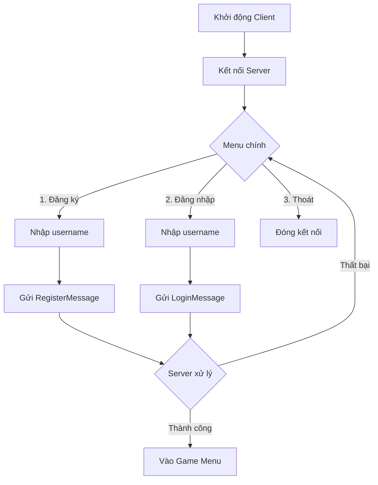
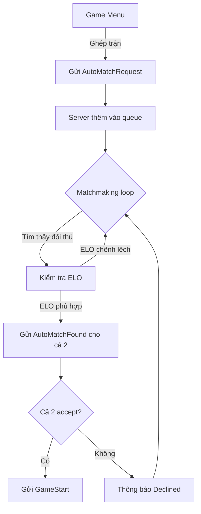
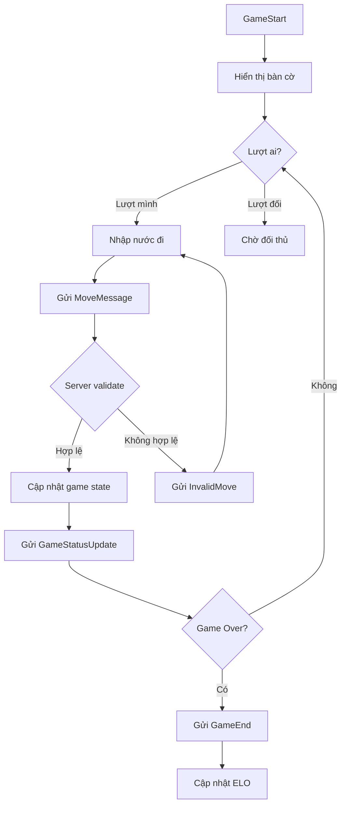

# 📖 Tài Liệu Hướng Dẫn Chi Tiết - TCP Chess

## 📋 Mục Lục

1. [Tổng Quan Project](#1-tổng-quan-project)
2. [Cấu Trúc Thư Mục](#2-cấu-trúc-thư-mục)
3. [Kiến Trúc Hệ Thống](#3-kiến-trúc-hệ-thống)
4. [Chi Tiết Từng Module](#4-chi-tiết-từng-module)
5. [Giao Thức Truyền Thông](#5-giao-thức-truyền-thông)
6. [Flow Hoạt Động](#6-flow-hoạt-động)
7. [Hướng Dẫn Build & Chạy](#7-hướng-dẫn-build--chạy)
8. [Mở Rộng & Phát Triển](#8-mở-rộng--phát-triển)

---

## 1. Tổng Quan Project

### 1.1 Mô Tả
**TCP Chess** là một ứng dụng chơi cờ vua trực tuyến đa người chơi, xây dựng trên nền tảng **C++17** sử dụng giao thức **TCP/IP** cho việc truyền thông client-server.

### 1.2 Tính Năng Chính
| Tính năng | Mô tả |
|-----------|-------|
| 🎮 **Đăng ký / Đăng nhập** | Hệ thống tài khoản đơn giản (chỉ cần username) |
| ⚔️ **Ghép trận tự động** | Matchmaking dựa trên ELO (chênh lệch ≤ 300) |
| 👥 **Thách đấu trực tiếp** | Thách đấu người chơi cụ thể |
| 👀 **Xem trận đấu** | Spectate trận đấu của người khác |
| 📜 **Lịch sử trận đấu** | Lưu trữ và xem lại các trận đã chơi |
| 🏆 **Hệ thống ELO** | Tính điểm rating sau mỗi trận |

### 1.3 Công Nghệ Sử Dụng
- **Ngôn ngữ:** C++17
- **Giao thức mạng:** TCP/IP (POSIX Sockets)
- **Multi-threading:** std::thread, std::mutex
- **Thư viện bên thứ 3:**
  - `nlohmann/json` - Xử lý JSON
  - `tabulate` - Hiển thị bảng trong terminal
  - Chess engine tự viết (dựa trên chess-library)

---

## 2. Cấu Trúc Thư Mục

```
Chess_TCP_C/
├── 📁 build/                    # Thư mục chứa file thực thi sau khi build
│   ├── client_main              # File thực thi client
│   └── server_main              # File thực thi server
│
├── 📁 chess_engine/             # Engine cờ vua
│   ├── chess.hpp                # Thư viện cờ vua (luật chơi, di chuyển)
│   ├── chess_bot.hpp            # AI Bot (không sử dụng, có thể xóa)
│   └── Book.txt                 # Opening book (không sử dụng)
│
├── 📁 client/                   # Mã nguồn phía Client
│   ├── client_main.cpp          # Entry point của client
│   ├── network_client.hpp       # Xử lý kết nối TCP đến server
│   ├── message_handler.hpp      # Xử lý tin nhắn từ server
│   ├── logic_handler.hpp        # Logic xử lý game flow
│   ├── input_handler.hpp        # Xử lý input từ người dùng
│   ├── session_data.hpp         # Lưu trữ session hiện tại
│   ├── ui.hpp                   # Giao diện console (menu, thông báo)
│   └── board_display.hpp        # Hiển thị bàn cờ trong terminal
│
├── 📁 server/                   # Mã nguồn phía Server
│   ├── server_main.cpp          # Entry point của server
│   ├── network_server.hpp       # Quản lý kết nối TCP với clients
│   ├── message_handler.hpp      # Xử lý tin nhắn từ clients
│   ├── game_manager.hpp         # Quản lý các ván cờ & matchmaking
│   └── data_storage.hpp         # Lưu trữ dữ liệu (users, matches)
│
├── 📁 common/                   # Code dùng chung giữa client & server
│   ├── const.hpp                # Các hằng số (PORT, IP, ELO mặc định...)
│   ├── protocol.hpp             # Định nghĩa cấu trúc gói tin
│   ├── message.hpp              # Các loại message (Login, Move, GameStart...)
│   ├── utils.hpp                # Utility functions (big-endian conversion)
│   └── json_handler.hpp         # Đọc/ghi file JSON
│
├── 📁 libraries/                # Thư viện bên thứ 3
│   ├── json.hpp                 # nlohmann/json (24,767 dòng)
│   └── tabulate.hpp             # Thư viện tạo bảng console
│
├── 📁 data/                     # Dữ liệu persistent
│   ├── users.json               # Thông tin người dùng (username, elo, history)
│   └── matches.json             # Lịch sử các trận đấu
│
├── 📁 test/                     # Unit tests
│
├── Makefile                     # File build
└── README.md                    # Hướng dẫn nhanh
```

---

## 3. Kiến Trúc Hệ Thống

### 3.1 Mô Hình Client-Server

```
┌─────────────────┐         TCP/IP         ┌─────────────────┐
│                 │◄──────────────────────►│                 │
│   CLIENT 1      │                        │                 │
│                 │                        │                 │
└─────────────────┘                        │                 │
                                           │    SERVER       │
┌─────────────────┐         TCP/IP         │                 │
│                 │◄──────────────────────►│   (Port 8088)   │
│   CLIENT 2      │                        │                 │
│                 │                        │                 │
└─────────────────┘                        │                 │
                                           │                 │
┌─────────────────┐         TCP/IP         │                 │
│                 │◄──────────────────────►│                 │
│   CLIENT N      │                        │                 │
│                 │                        └─────────────────┘
└─────────────────┘
```

### 3.2 Luồng Xử Lý Server (Multi-threaded)

```
┌──────────────────────────────────────────────────────────────┐
│                        SERVER                                 │
│                                                               │
│  ┌─────────────┐                                             │
│  │ Main Thread │ ──► accept() ──► Tạo thread mới cho client  │
│  └─────────────┘                                             │
│         │                                                     │
│         ▼                                                     │
│  ┌─────────────────────────────────────────────────────────┐ │
│  │  Client Threads Pool                                     │ │
│  │  ┌──────────┐ ┌──────────┐ ┌──────────┐                │ │
│  │  │ Thread 1 │ │ Thread 2 │ │ Thread N │  ...           │ │
│  │  │(Client 1)│ │(Client 2)│ │(Client N)│                │ │
│  │  └──────────┘ └──────────┘ └──────────┘                │ │
│  └─────────────────────────────────────────────────────────┘ │
│         │                                                     │
│         ▼                                                     │
│  ┌─────────────────────────────────────────────────────────┐ │
│  │             Matchmaking Thread                           │ │
│  │    (Chạy song song, xử lý hàng đợi ghép trận)           │ │
│  └─────────────────────────────────────────────────────────┘ │
│                                                               │
│  ┌─────────────────────────────────────────────────────────┐ │
│  │            Shared Resources (mutex protected)            │ │
│  │  • GameManager (quản lý games)                          │ │
│  │  • DataStorage (quản lý users/matches)                  │ │
│  │  • NetworkServer (quản lý connections)                  │ │
│  └─────────────────────────────────────────────────────────┘ │
└──────────────────────────────────────────────────────────────┘
```

### 3.3 Singleton Pattern
Các class sau sử dụng Singleton để đảm bảo chỉ có 1 instance:
- `NetworkServer` - Server
- `NetworkClient` - Client
- `GameManager` - Server
- `DataStorage` - Server
- `SessionData` - Client

---

## 4. Chi Tiết Từng Module

### 4.1 Server Modules

#### 📌 `server_main.cpp` - Entry Point
```cpp
// Luồng chính:
1. Khởi tạo NetworkServer (lắng nghe port 8088)
2. Vòng lặp vô hạn: accept() kết nối mới
3. Tạo thread mới cho mỗi client (handleClient)
4. handleClient: recv() packet → MessageHandler xử lý
```

#### 📌 `network_server.hpp` - Quản Lý Kết Nối
| Method | Mô tả |
|--------|-------|
| `acceptConnection()` | Chấp nhận kết nối mới |
| `sendPacket()` | Gửi packet đến client theo fd |
| `sendPacketToUsername()` | Gửi packet theo username |
| `receivePacket()` | Nhận packet từ client |
| `setUsername()` / `getUsername()` | Quản lý mapping fd ↔ username |

**Cấu trúc ClientInfo:**
```cpp
struct ClientInfo {
    std::vector<uint8_t> buffer;  // Buffer nhận dữ liệu
    std::mutex mutex;              // Thread-safe
    std::string username;          // Username sau khi login
};
```

#### 📌 `game_manager.hpp` - Quản Lý Ván Cờ

**Class Game:** Đại diện cho 1 ván cờ
```cpp
class Game {
    std::string game_id;
    std::string player_white_name;
    std::string player_black_name;
    std::string current_turn;
    chess::Board board;           // Trạng thái bàn cờ
    
    bool makeMove(uci_move);      // Thực hiện nước đi
    bool isGameOver();
    std::string getFen();         // Lấy FEN hiện tại
};
```

**Class GameManager:** Singleton quản lý tất cả games
| Method | Mô tả |
|--------|-------|
| `createGame()` | Tạo ván mới giữa 2 người chơi |
| `handleMove()` | Xử lý nước đi, kiểm tra hợp lệ |
| `addPlayerToQueue()` | Thêm vào hàng đợi matchmaking |
| `matchmakingLoop()` | Thread ghép trận (ELO-based) |
| `addSpectator()` | Thêm người xem |

#### 📌 `data_storage.hpp` - Lưu Trữ Dữ Liệu

**UserModel:**
```cpp
struct UserModel {
    std::string username;
    uint16_t elo;
    std::vector<std::string> match_history;
};
```

**MatchModel:**
```cpp
struct MatchModel {
    std::string game_id;
    std::string white_username, black_username;
    std::string start_fen;
    std::vector<Move> moves;      // Lịch sử nước đi
    std::string result, reason;
};
```

Dữ liệu được persist ra file JSON (`data/users.json`, `data/matches.json`).

---

### 4.2 Client Modules

#### 📌 `client_main.cpp` - Entry Point
```cpp
// Luồng chính:
1. Kết nối đến server (127.0.0.1:8088)
2. Khởi động InputHandler thread (nhận input từ user)
3. Khởi động menu thread (handleInitialMenu)
4. Vòng lặp: receivePacket() → MessageHandler.pushMessage()
```

#### 📌 `network_client.hpp` - Kết Nối TCP
| Method | Mô tả |
|--------|-------|
| `sendPacket()` | Gửi packet đến server |
| `receivePacket()` | Nhận packet từ server |
| `closeConnection()` | Đóng kết nối |

#### 📌 `logic_handler.hpp` - Xử Lý Logic Game
| Method | Mô tả |
|--------|-------|
| `handleInitialMenu()` | Menu đăng ký/đăng nhập |
| `handleGameMenu()` | Menu chọn chế độ chơi |
| `handleAutoMatch()` | Xử lý tìm trận |
| `handleGame()` | Vòng lặp chơi game |
| `handleSpectate()` | Xử lý xem trận |

#### 📌 `session_data.hpp` - Dữ Liệu Session
```cpp
class SessionData {
    std::string username;
    std::string current_game_id;
    std::string current_fen;
    bool is_playing;
    bool is_spectating;
    std::atomic<bool> running;
};
```

#### 📌 `ui.hpp` - Giao Diện Console
- `printLogo()` - In logo TCP Chess
- `displayInitialMenu()` - Menu đăng ký/đăng nhập
- `displayGameMenu()` - Menu chọn chế độ
- `showBoard()` - Hiển thị bàn cờ
- `printErrorMessage()` / `printSuccessMessage()` - Thông báo

#### 📌 `board_display.hpp` - Hiển Thị Bàn Cờ
```
    a   b   c   d   e   f   g   h
  ┌───┬───┬───┬───┬───┬───┬───┬───┐
8 │ ♜ │ ♞ │ ♝ │ ♛ │ ♚ │ ♝ │ ♞ │ ♜ │ 8
  ├───┼───┼───┼───┼───┼───┼───┼───┤
7 │ ♟ │ ♟ │ ♟ │ ♟ │ ♟ │ ♟ │ ♟ │ ♟ │ 7
  ├───┼───┼───┼───┼───┼───┼───┼───┤
...
```

---

### 4.3 Common Modules

#### 📌 `const.hpp` - Hằng Số
```cpp
namespace Const {
    const uint16_t SERVER_PORT = 8088;
    const std::string SERVER_IP = "127.0.0.1";
    const uint16_t BUFFER_SIZE = 1024;
    const uint16_t DEFAULT_ELO = 1200;
    const uint16_t ELO_THRESHOLD = 300;  // Ngưỡng ghép trận
}
```

#### 📌 `protocol.hpp` - Cấu Trúc Gói Tin
```cpp
enum class MessageType : uint8_t {
    // Auth
    REGISTER = 0x10,
    LOGIN = 0x20,
    
    // Game
    GAME_START = 0x40,
    MOVE = 0x41,
    GAME_END = 0x44,
    
    // Matchmaking
    AUTO_MATCH_REQUEST = 0x55,
    AUTO_MATCH_FOUND = 0x56,
    // ... và nhiều loại khác
};

struct Packet {
    MessageType type;      // 1 byte
    uint16_t length;       // 2 bytes (big-endian)
    std::vector<uint8_t> payload;
};
```

#### 📌 `message.hpp` - Các Loại Message
Mỗi message có cấu trúc riêng với `serialize()` và `deserialize()`:

| Message | Mô tả |
|---------|-------|
| `RegisterMessage` | Client → Server: Đăng ký |
| `LoginMessage` | Client → Server: Đăng nhập |
| `GameStartMessage` | Server → Client: Bắt đầu game |
| `MoveMessage` | Client → Server: Gửi nước đi |
| `GameStatusUpdateMessage` | Server → Client: Cập nhật trạng thái |
| `AutoMatchRequestMessage` | Client → Server: Yêu cầu ghép trận |

---

### 4.4 Chess Engine

#### 📌 `chess.hpp` - Thư Viện Cờ Vua (~4900 dòng)
Thư viện cung cấp đầy đủ:
- Class `Board` - Quản lý trạng thái bàn cờ
- Class `Move` - Đại diện nước đi
- `movegen::legalmoves()` - Sinh nước đi hợp lệ
- `uci::uciToMove()` / `moveToUci()` - Chuyển đổi UCI
- Kiểm tra chiếu/chiếu bí/hòa

---

## 5. Giao Thức Truyền Thông

### 5.1 Cấu Trúc Packet

```
┌─────────────┬──────────────┬─────────────────────┐
│   Type      │   Length     │      Payload        │
│  (1 byte)   │  (2 bytes)   │   (Length bytes)    │
│             │ Big-Endian   │                     │
└─────────────┴──────────────┴─────────────────────┘
```

### 5.2 Ví Dụ: Login Flow

```
CLIENT                                    SERVER
   │                                         │
   │──── LoginMessage (type=0x20) ──────────►│
   │     payload: [username_len][username]   │
   │                                         │
   │◄─── LoginSuccessMessage (type=0x21) ────│
   │     payload: [username_len][username]   │
   │              [elo: 2 bytes]             │
   │                                         │
```

### 5.3 Ví Dụ: Game Flow

```
CLIENT 1                  SERVER                  CLIENT 2
   │                         │                         │
   │── AutoMatchRequest ────►│◄── AutoMatchRequest ───│
   │                         │                         │
   │◄─ AutoMatchFound ───────│────► AutoMatchFound ───►│
   │                         │                         │
   │── AutoMatchAccepted ───►│◄── AutoMatchAccepted ──│
   │                         │                         │
   │◄──── GameStart ─────────│─────► GameStart ───────►│
   │                         │                         │
   │────── Move ────────────►│                         │
   │                         │                         │
   │◄── GameStatusUpdate ────│───► GameStatusUpdate ──►│
   │                         │                         │
   │                         │◄────── Move ───────────│
   │                         │                         │
   │◄── GameStatusUpdate ────│───► GameStatusUpdate ──►│
   │                         │                         │
   │        ...              │           ...           │
   │                         │                         │
   │◄────── GameEnd ─────────│─────► GameEnd ─────────►│
```

---

## 6. Flow Hoạt Động

### 6.1 Flow Đăng Nhập



### 6.2 Flow Ghép Trận



### 6.3 Flow Chơi Game



---

## 7. Hướng Dẫn Build & Chạy

### 7.1 Yêu Cầu
- **OS:** Linux
- **Compiler:** g++ với C++17 support
- **Build tool:** Make

### 7.2 Build

```bash
# Build cả server và client
make all

# Hoặc build riêng
make $(BUILD_DIR)/server_main
make $(BUILD_DIR)/client_main
```

### 7.3 Chạy

```bash
# Terminal 1: Chạy Server
make run_server
# hoặc: ./build/server_main

# Terminal 2+: Chạy Client
make run_client
# hoặc: ./build/client_main
```

### 7.4 Dọn dẹp

```bash
make clean
```

### 7.5 Tài khoản Demo
Các username có sẵn để test: `vu1`, `vu2`, `viet1`, `viet2`

---

## 8. Mở Rộng & Phát Triển

### 8.1 Thêm Loại Message Mới

1. **Định nghĩa MessageType** trong `protocol.hpp`:
```cpp
enum class MessageType : uint8_t {
    // ...
    MY_NEW_MESSAGE = 0x70,
};
```

2. **Tạo struct Message** trong `message.hpp`:
```cpp
struct MyNewMessage {
    // fields...
    
    MessageType getType() const { return MessageType::MY_NEW_MESSAGE; }
    std::vector<uint8_t> serialize() const { /* ... */ }
    static MyNewMessage deserialize(const std::vector<uint8_t>& payload) { /* ... */ }
};
```

3. **Xử lý trong MessageHandler** (server hoặc client).

### 8.2 Tính Năng Có Thể Thêm
- [ ] Chat trong game
- [ ] Time control (đồng hồ)
- [ ] Undo/Takeback
- [ ] Tournaments
- [ ] Leaderboard
- [ ] Password authentication
- [ ] Database thay vì JSON files

---

## 📚 Tài Liệu Tham Khảo

- [Chess Programming Wiki](https://www.chessprogramming.org/)
- [UCI Protocol](https://www.shredderchess.com/chess-features/uci-universal-chess-interface.html)
- [FEN Notation](https://en.wikipedia.org/wiki/Forsyth%E2%80%93Edwards_Notation)
- [ELO Rating System](https://en.wikipedia.org/wiki/Elo_rating_system)
- [POSIX Sockets](https://man7.org/linux/man-pages/man7/socket.7.html)

---

*Tài liệu được tạo cho mục đích học tập và phát triển.*

