# Chess TCP - Tài Liệu Luồng Gọi Hàm Chi Tiết

## Mục Lục
1. [Tổng Quan Kiến Trúc](#1-tổng-quan-kiến-trúc)
2. [Cấu Trúc Thư Mục](#2-cấu-trúc-thư-mục)
3. [Luồng Xử Lý Server](#3-luồng-xử-lý-server)
4. [Luồng Xử Lý Client](#4-luồng-xử-lý-client)
5. [Luồng Chi Tiết Các Tính Năng](#5-luồng-chi-tiết-các-tính-năng)
6. [Danh Sách Message Types](#6-danh-sách-message-types)
7. [Danh Sách Hàm Quan Trọng](#7-danh-sách-hàm-quan-trọng)

---

## 1. Tổng Quan Kiến Trúc

### Mô Hình Client-Server

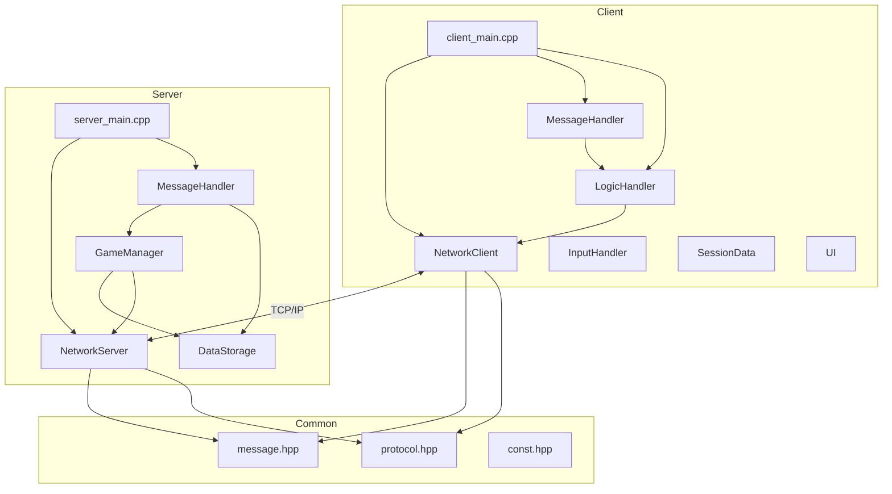

### Singleton Pattern
Các lớp sử dụng Singleton:
- `NetworkServer::getInstance()`
- `NetworkClient::getInstance()`
- `GameManager::getInstance()`
- `DataStorage::getInstance()`
- `SessionData::getInstance()`

---

## 2. Cấu Trúc Thư Mục

```
Chess_TCP_C/
├── common/                    # Shared code giữa client và server
│   ├── const.hpp             # Hằng số (IP, PORT, ELO mặc định...)
│   ├── protocol.hpp          # MessageType enum và Packet struct
│   ├── message.hpp           # Tất cả message classes (36+ loại)
│   ├── json_handler.hpp      # Xử lý JSON cho data persistence
│   └── utils.hpp             # Hàm tiện ích
│
├── server/                    # Server-side code
│   ├── server_main.cpp       # Entry point server
│   ├── network_server.hpp    # Socket handling, connection management
│   ├── message_handler.hpp   # Route messages đến handlers phù hợp
│   ├── game_manager.hpp      # Game logic, matchmaking, moves
│   └── data_storage.hpp      # User data, ELO, match history
│
├── client/                    # Client-side code
│   ├── client_main.cpp       # Entry point client
│   ├── network_client.hpp    # TCP connection đến server
│   ├── message_handler.hpp   # Handle responses từ server
│   ├── logic_handler.hpp     # Business logic, menus, game flow
│   ├── session_data.hpp      # Client state (username, game info)
│   ├── input_handler.hpp     # Thread xử lý user input
│   ├── ui.hpp                # Console UI, colors, formatting
│   └── board_display.hpp     # Hiển thị bàn cờ
│
├── libraries/                 # Third-party libraries
│   ├── json.hpp              # nlohmann/json
│   └── tabulate.hpp          # Table formatting
│
├── chess_engine/             # Chess rules engine
│   └── chess.hpp             # Board, moves, FEN handling
│
└── data/                     # Persistent data (JSON files)
    ├── users.json            # User accounts và ELO
    └── matches.json          # Match history
```

---

## 3. Luồng Xử Lý Server

### 3.1 Entry Point - `server_main.cpp`

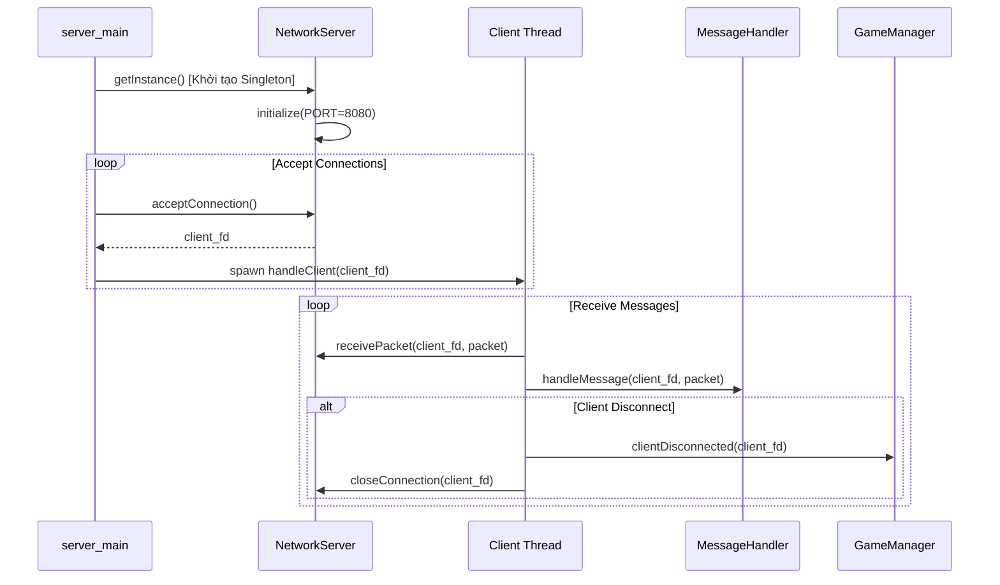

### 3.2 Message Routing - Server `message_handler.hpp`

| MessageType | Handler Function | Mô tả |
|-------------|-----------------|-------|
| `REGISTER` | `handleRegister()` | Đăng ký user mới |
| `LOGIN` | `handleLogin()` | Đăng nhập user |
| `MOVE` | `handleMove()` | Xử lý nước đi |
| `AUTO_MATCH_REQUEST` | `handleAutoMatchRequest()` | Yêu cầu tìm trận |
| `AUTO_MATCH_ACCEPTED` | `handleAutoMatchAccepted()` | Chấp nhận trận |
| `AUTO_MATCH_DECLINED` | `handleAutoMatchDeclined()` | Từ chối trận |
| `REQUEST_PLAYER_LIST` | `handleRequestPlayerList()` | Lấy danh sách người chơi |
| `CHALLENGE_REQUEST` | `handleChallengeRequest()` | Thách đấu người chơi |
| `CHALLENGE_RESPONSE` | `handleChallengeResponse()` | Phản hồi thách đấu |
| `SURRENDER` | `handleSurrender()` | Đầu hàng |

### 3.3 Game Manager - Luồng xử lý chính

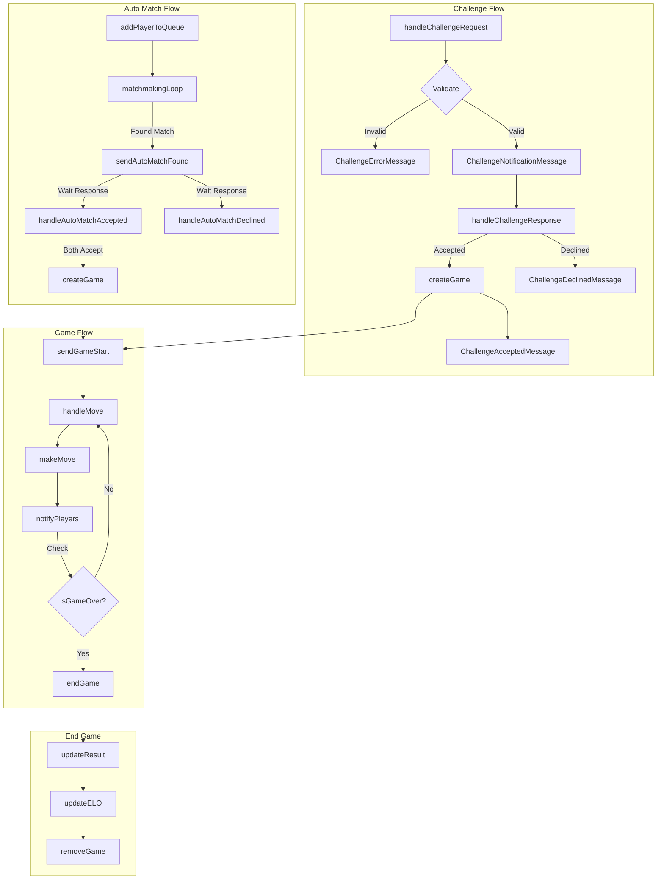

> **Lưu ý:** Challenge không sử dụng `PendingGame` như Auto Match. Khi người được thách đấu chấp nhận, game được tạo ngay lập tức.

---

## 4. Luồng Xử Lý Client

### 4.1 Entry Point - `client_main.cpp`

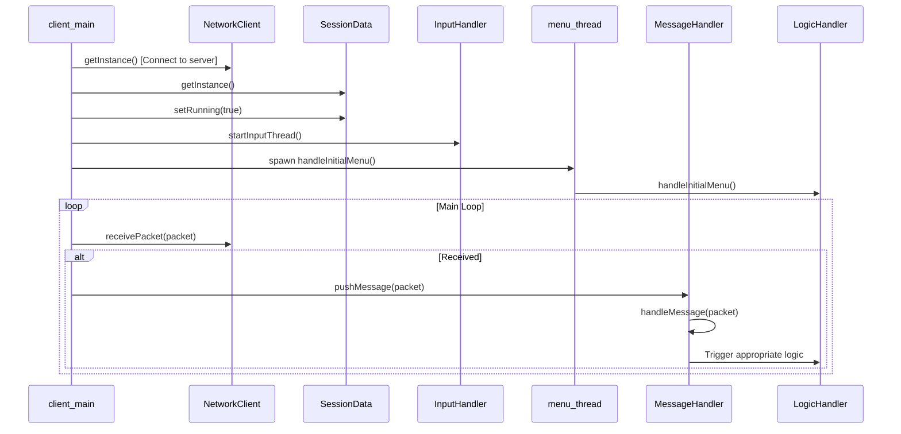

### 4.2 Message Routing - Client `message_handler.hpp`

| MessageType | Handler Function | Logic Triggered |
|-------------|-----------------|-----------------|
| `REGISTER_SUCCESS` | `handleRegisterSuccess()` | Show success → handleInitialMenu |
| `REGISTER_FAILURE` | `handleRegisterFailure()` | Show error |
| `LOGIN_SUCCESS` | `handleLoginSuccess()` | Save session → handleGameMenu |
| `LOGIN_FAILURE` | `handleLoginFailure()` | Show error |
| `GAME_START` | `handleGameStart()` | Display board → handleMove |
| `GAME_STATUS_UPDATE` | `handleGameStatusUpdate()` | Update board |
| `GAME_END` | `handleGameEnd()` | Show result → handleGameMenu |
| `AUTO_MATCH_FOUND` | `handleAutoMatchFound()` | handleMatchDecision |
| `PLAYER_LIST` | `handlePlayerList()` | handlePlayerListDecision |
| `CHALLENGE_NOTIFICATION` | `handleChallengeNotification()` | handleChallengeDecision |
| `INVALID_MOVE` | `handleInvalidMove()` | Show error |

---

## 5. Luồng Chi Tiết Các Tính Năng

### 5.1 Đăng Ký (Register)

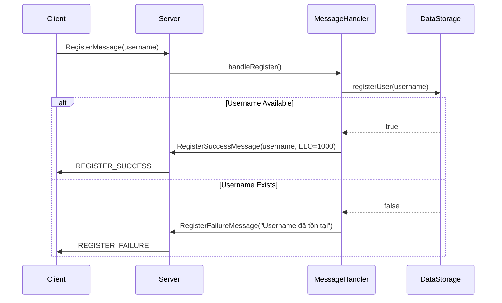

### 5.2 Đăng Nhập (Login)

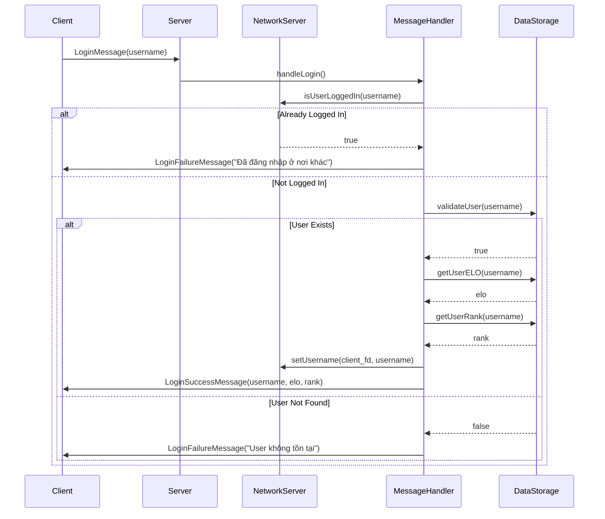

### 5.3 Matchmaking Tự Động (Auto Match)

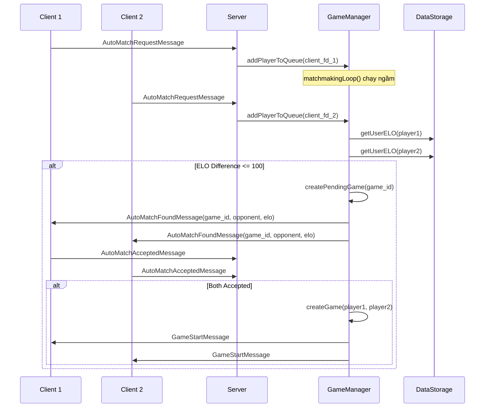

### 5.4 Thách Đấu (Challenge)

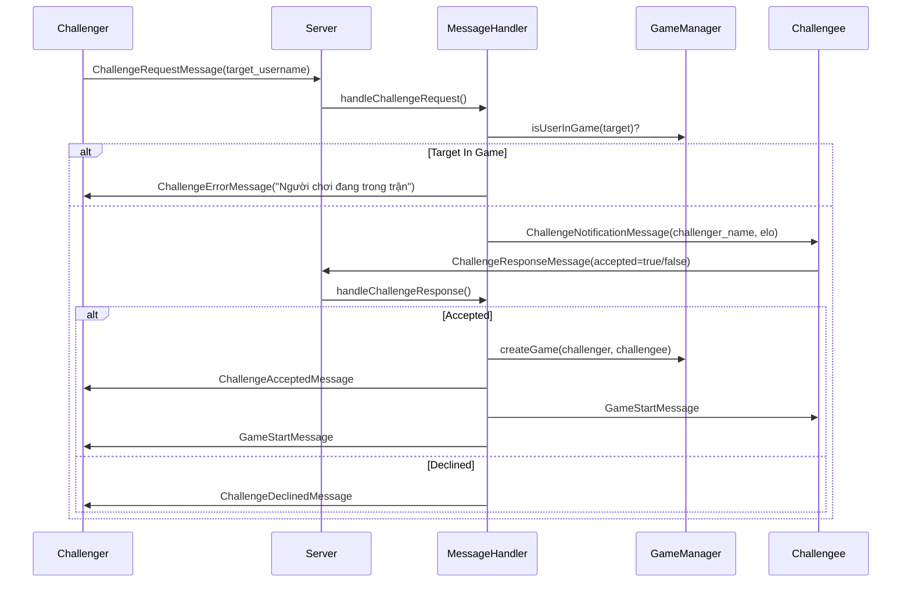

### 5.5 Xử Lý Nước Đi (Move)

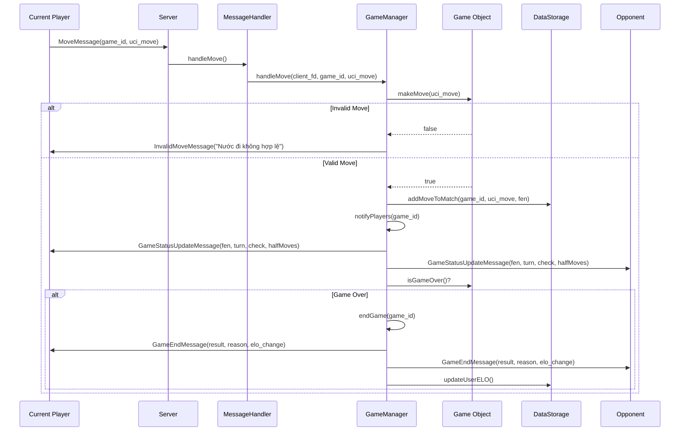

### 5.6 Đầu Hàng (Surrender)

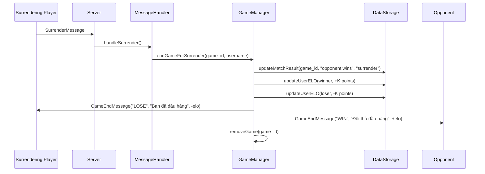

### 5.7 Ngắt Kết Nối (Disconnect)

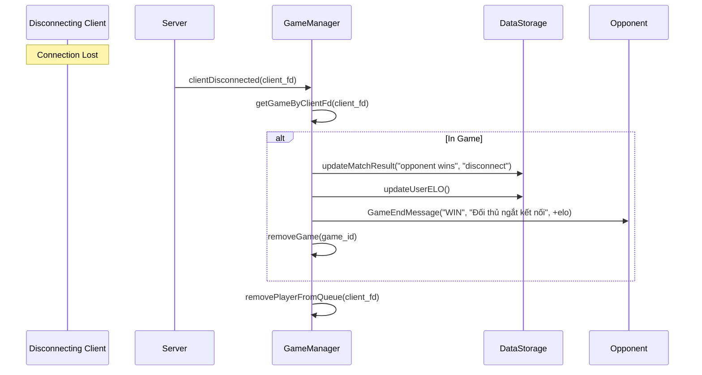

---

## 6. Danh Sách Message Types

### 6.1 Protocol Definition (`protocol.hpp`)

| Hex Code | MessageType | Hướng | Mô tả |
|----------|-------------|-------|-------|
| `0x10` | `REGISTER` | C→S | Đăng ký user mới |
| `0x11` | `REGISTER_SUCCESS` | S→C | Đăng ký thành công |
| `0x12` | `REGISTER_FAILURE` | S→C | Đăng ký thất bại |
| `0x20` | `LOGIN` | C→S | Đăng nhập |
| `0x21` | `LOGIN_SUCCESS` | S→C | Đăng nhập thành công |
| `0x22` | `LOGIN_FAILURE` | S→C | Đăng nhập thất bại |
| `0x30` | `REQUEST_PLAYER_LIST` | C→S | Lấy danh sách người chơi |
| `0x31` | `PLAYER_LIST` | S→C | Danh sách người chơi online |
| `0x40` | `GAME_START` | S→C | Thông báo bắt đầu game |
| `0x41` | `MOVE` | C→S | Gửi nước đi |
| `0x42` | `INVALID_MOVE` | S→C | Nước đi không hợp lệ |
| `0x43` | `GAME_STATUS_UPDATE` | S→C | Cập nhật trạng thái game |
| `0x44` | `GAME_END` | S→C | Thông báo kết thúc game |
| `0x45` | `SURRENDER` | C→S | Đầu hàng |
| `0x50` | `CHALLENGE_REQUEST` | C→S | Gửi lời thách đấu |
| `0x51` | `CHALLENGE_NOTIFICATION` | S→C | Thông báo có thách đấu |
| `0x52` | `CHALLENGE_RESPONSE` | C→S | Phản hồi thách đấu |
| `0x53` | `CHALLENGE_ACCEPTED` | S→C | Thách đấu được chấp nhận |
| `0x54` | `CHALLENGE_DECLINED` | S→C | Thách đấu bị từ chối |
| `0x55` | `AUTO_MATCH_REQUEST` | C→S | Yêu cầu tìm trận tự động |
| `0x56` | `AUTO_MATCH_FOUND` | S→C | Tìm thấy đối thủ |
| `0x57` | `AUTO_MATCH_ACCEPTED` | C→S | Chấp nhận trận đấu |
| `0x58` | `AUTO_MATCH_DECLINED` | C→S | Từ chối trận đấu |
| `0x59` | `MATCH_DECLINED_NOTIFICATION` | S→C | Thông báo đối thủ từ chối |
| `0x5B` | `CHALLENGE_ERROR` | S→C | Lỗi thách đấu |

### 6.2 Packet Structure

```
+------------+------------+------------------+
| Type (1B)  | Length (2B)| Payload (N bytes)|
+------------+------------+------------------+
```

---

## 7. Danh Sách Hàm Quan Trọng

### 7.1 NetworkServer (`network_server.hpp`)

| Hàm | Mô tả |
|-----|-------|
| `getInstance()` | Lấy singleton instance |
| `initialize(port)` | Khởi tạo server socket |
| `acceptConnection()` | Chấp nhận kết nối mới → `client_fd` |
| `receivePacket(client_fd, packet)` | Nhận packet từ client |
| `sendPacket(client_fd, type, payload)` | Gửi packet đến client |
| `sendPacketToUsername(username, type, payload)` | Gửi packet theo username |
| `setUsername(client_fd, username)` | Map client_fd với username |
| `getUsername(client_fd)` | Lấy username từ client_fd |
| `getClientFD(username)` | Lấy client_fd từ username |
| `isUserLoggedIn(username)` | Kiểm tra user đã đăng nhập chưa |
| `isClientConnected(client_fd)` | Kiểm tra client còn kết nối không |
| `closeConnection(client_fd)` | Đóng kết nối client |

### 7.2 GameManager (`game_manager.hpp`)

| Hàm | Mô tả |
|-----|-------|
| `getInstance()` | Lấy singleton instance |
| `matchmakingLoop()` | Thread loop tìm cặp đấu |
| `addPlayerToQueue(client_fd)` | Thêm người chơi vào hàng đợi |
| `removePlayerFromQueue(client_fd)` | Xóa người chơi khỏi hàng đợi |
| `createGame(white, black, fen)` | Tạo game mới → `game_id` |
| `getGame(game_id)` | Lấy Game object |
| `getGameByClientFd(client_fd)` | Lấy Game theo client_fd |
| `handleMove(client_fd, game_id, uci_move)` | Xử lý nước đi |
| `makeMove(game_id, uci_move)` | Thực hiện nước đi |
| `notifyPlayers(game_id, game)` | Gửi update cho cả 2 người chơi |
| `endGame(game_id, game)` | Kết thúc game, cập nhật ELO |
| `endGameForSurrender(game_id, player)` | Kết thúc do đầu hàng |
| `clientDisconnected(client_fd)` | Xử lý ngắt kết nối |
| `handleAutoMatchAccepted(client_fd, game_id)` | Xử lý chấp nhận match |
| `handleAutoMatchDeclined(client_fd, game_id)` | Xử lý từ chối match |
| `isUserInGame(username)` | Kiểm tra user đang chơi không |
| `getUserGameId(username)` | Lấy game_id của user |
| `getOpponent(game_id, player)` | Lấy tên đối thủ |

### 7.3 Game Class (`game_manager.hpp`)

| Hàm | Mô tả |
|-----|-------|
| `Game(id, p1, p2, fen)` | Constructor |
| `makeMove(uci_move)` | Thực hiện nước đi → bool |
| `isInCheck()` | Kiểm tra đang bị chiếu không |
| `isGameOver()` | Kiểm tra game kết thúc chưa |
| `getFen()` | Lấy FEN string hiện tại |
| `getResult()` | Lấy kết quả (WHITE/BLACK/DRAW) |
| `getResultReason()` | Lấy lý do kết thúc |
| `toggleTurn()` | Đổi lượt chơi |

### 7.4 DataStorage (`data_storage.hpp`)

| Hàm | Mô tả |
|-----|-------|
| `getInstance()` | Lấy singleton instance |
| `registerUser(username, elo)` | Đăng ký user mới |
| `validateUser(username)` | Kiểm tra user tồn tại |
| `getUserELO(username)` | Lấy điểm ELO |
| `updateUserELO(username, elo)` | Cập nhật điểm ELO |
| `getUserRank(username)` | Lấy thứ hạng |
| `getPlayerList()` | Lấy danh sách tất cả người chơi |
| `registerMatch(game_id, white, black, fen)` | Đăng ký trận đấu mới |
| `addMoveToMatch(game_id, move, fen)` | Thêm nước đi vào history |
| `updateMatchResult(game_id, result, reason)` | Cập nhật kết quả trận |
| `getMatch(game_id)` | Lấy thông tin trận đấu |
| `getAllMatches()` | Lấy tất cả trận đấu |
| `getMatchesByPlayer(username)` | Lấy trận đấu của 1 người chơi |

### 7.5 NetworkClient (`network_client.hpp`)

| Hàm | Mô tả |
|-----|-------|
| `getInstance()` | Lấy singleton instance |
| `connectToServer(ip, port)` | Kết nối đến server |
| `sendPacket(type, payload)` | Gửi packet đến server |
| `receivePacket(packet)` | Nhận packet từ server |
| `closeConnection()` | Đóng kết nối |

### 7.6 LogicHandler (`logic_handler.hpp`)

| Hàm | Mô tả |
|-----|-------|
| `handleInitialMenu()` | Menu đăng nhập/đăng ký |
| `handleGameMenu()` | Menu chính sau đăng nhập |
| `handleMatchDecision(message)` | Xử lý quyết định accept/decline match |
| `handleGameStart(message)` | Hiển thị bàn cờ khi game bắt đầu |
| `handleGameStatusUpdate(message)` | Cập nhật hiển thị bàn cờ |
| `handleMove()` | Nhận input nước đi từ user |
| `handlePlayerListDecision(players)` | Hiển thị và chọn thách đấu |
| `handleChallengeDecision(challenger)` | Xử lý nhận thách đấu |

---

## Phụ Lục: Thứ Tự Đọc Code Đề Xuất

```
1. README.md                        → Tổng quan project
2. common/const.hpp                 → Các hằng số cấu hình
3. common/protocol.hpp              → Định nghĩa MessageType và Packet
4. common/message.hpp               → Cấu trúc tất cả message types
5. server/data_storage.hpp          → Hiểu cách lưu trữ dữ liệu
6. server/network_server.hpp        → Socket và connection handling
7. server/message_handler.hpp       → Message routing logic
8. server/game_manager.hpp          → Core game logic ⭐
9. server/server_main.cpp           → Entry point
10. client/session_data.hpp         → Client state management
11. client/network_client.hpp       → Client-side networking
12. client/message_handler.hpp      → Client message handling
13. client/logic_handler.hpp        → Business logic ⭐
14. client/ui.hpp + board_display.hpp → UI rendering
15. client/client_main.cpp          → Entry point
```

---

*Tài liệu được tạo tự động - Phiên bản: 26/12/2024*
