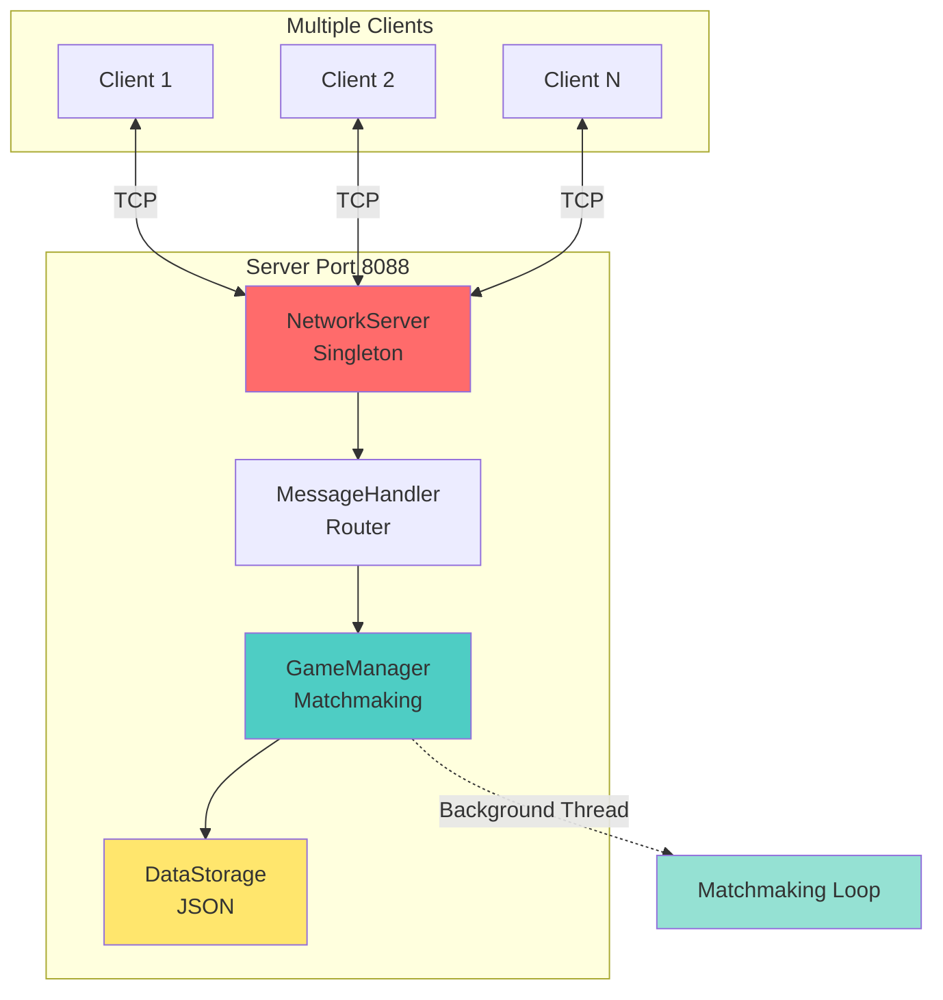
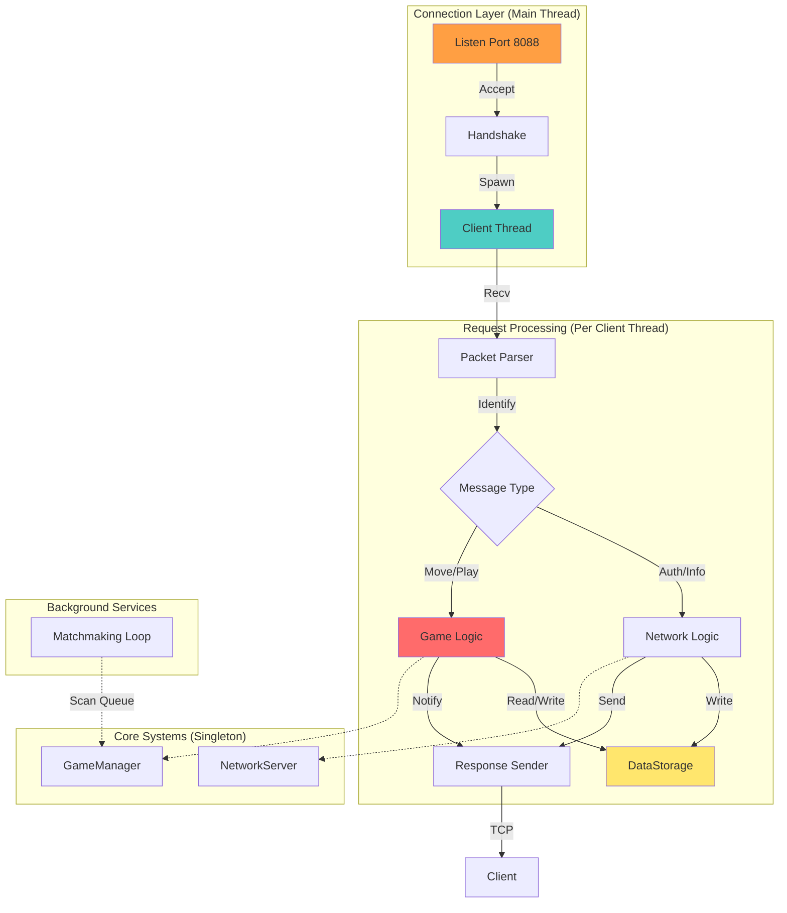
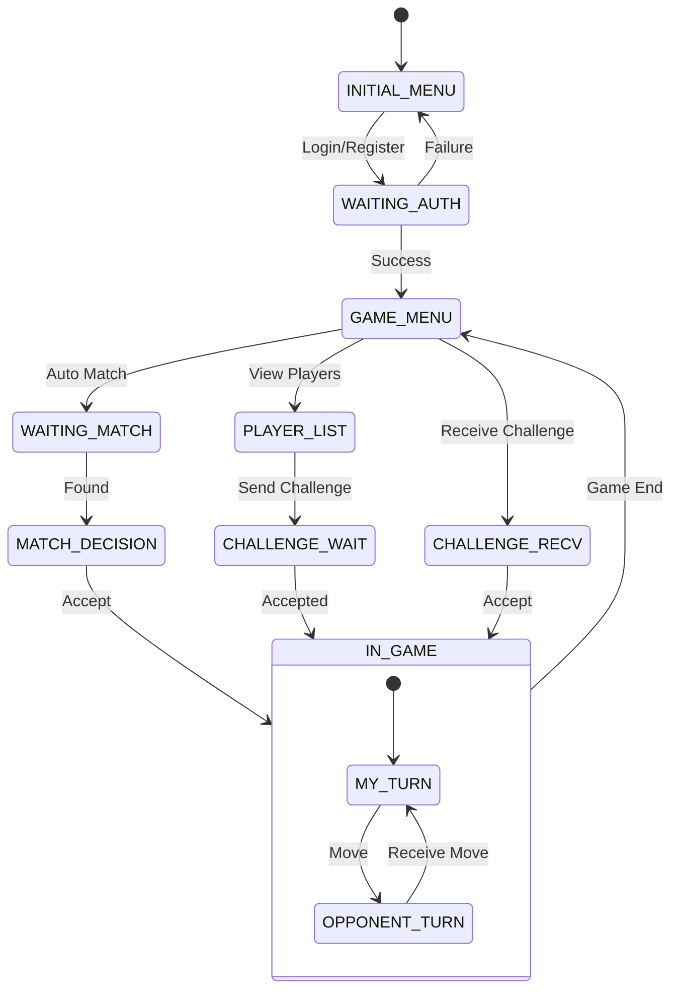
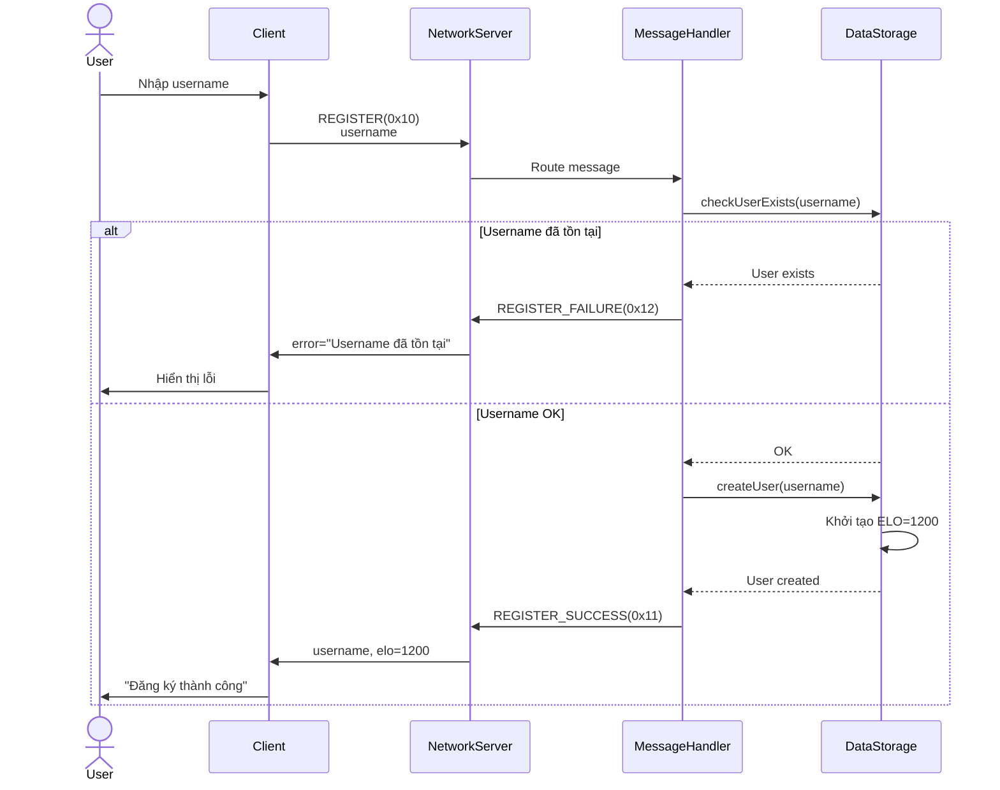
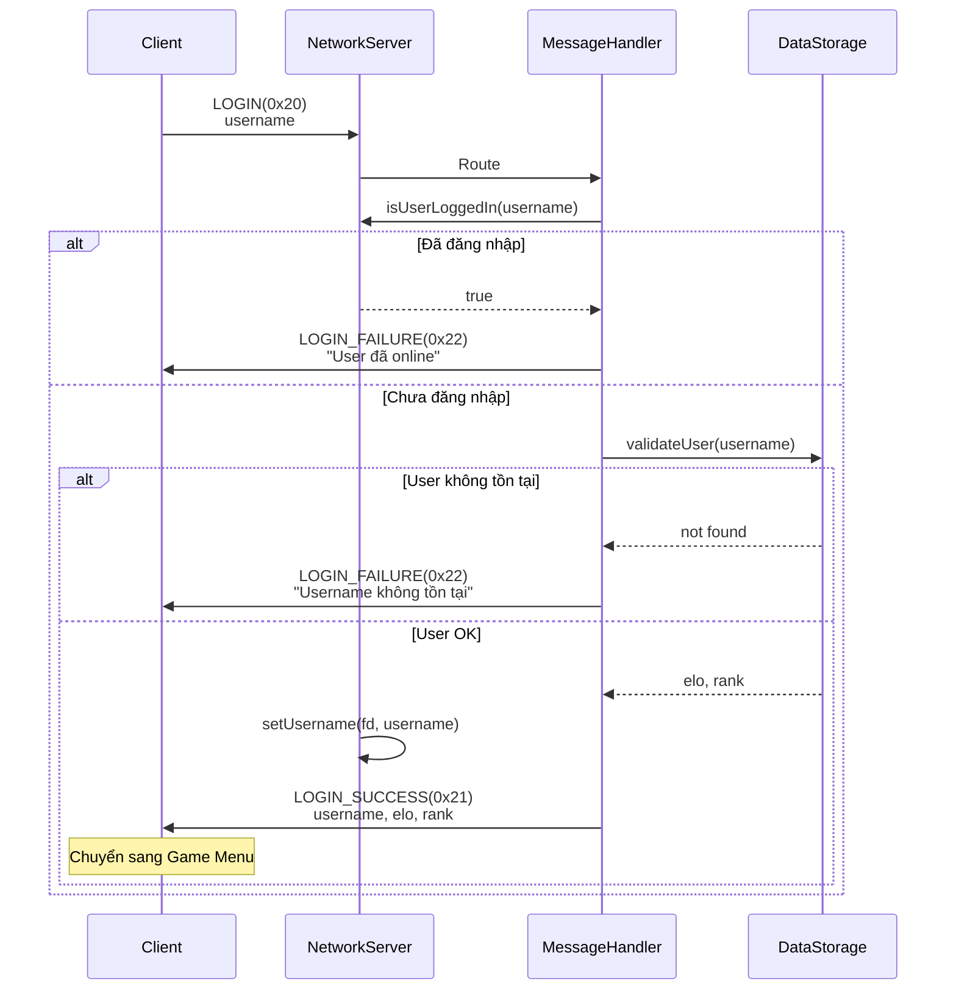
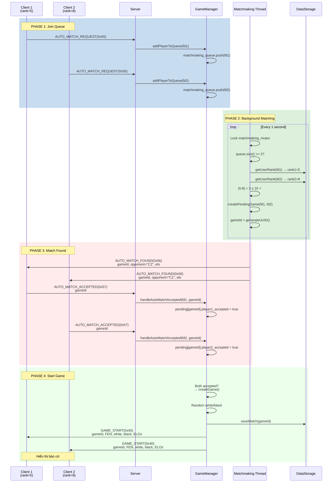
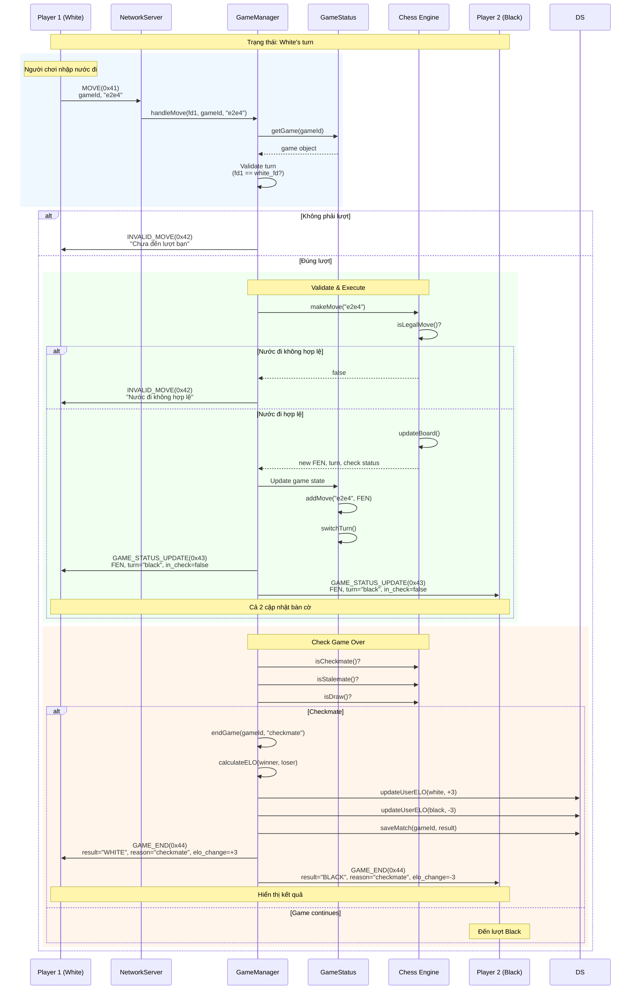
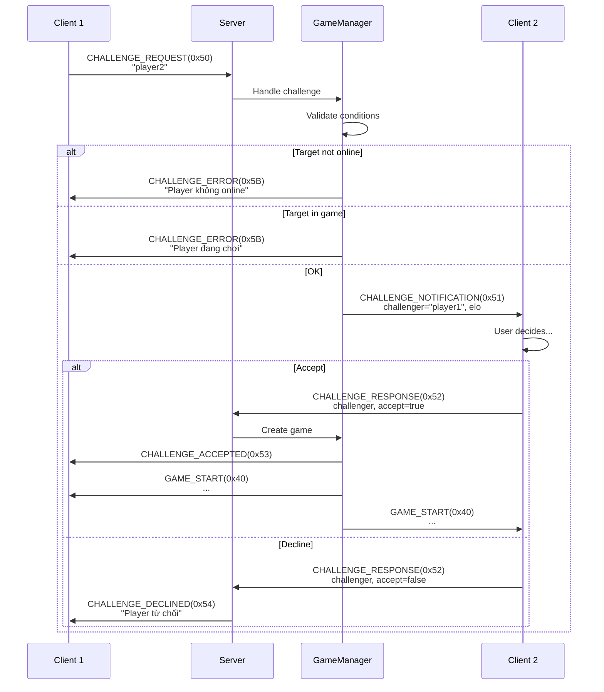
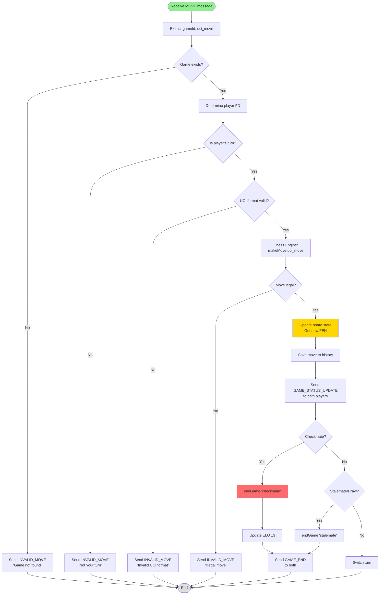
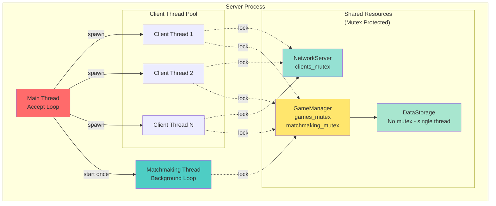

# Chess TCP - Chi Tiết Kỹ Thuật & Giao Thức

---

## 📋 Tổng Quan

**Chess TCP** - Hệ thống chơi cờ vua trực tuyến với kiến trúc Client-Server TCP/IP

**Tech Stack:** C++17 | TCP/IP | Multi-threading | JSON | Chess Library

**Features:** Đăng ký/Đăng nhập | Matchmaking (rank ≤10) | Thách đấu | Lịch sử | ELO/Rank

---

## 🏗️ Kiến Trúc Hệ Thống



---

## 🖥️ Chi Tiết Server

### Server Architecture Flow

Server sử dụng mô hình **Multi-threaded** với mỗi Client được xử lý trên một luồng riêng biệt, kết hợp với các Singleton Manager để quản lý trạng thái chung.



---

## 💻 Chi Tiết Client

### Client Architecture (Event-Driven)

Client sử dụng mô hình **Single-threaded Event Loop** với `poll()` để xử lý đồng thời user input và server messages mà không cần đa luồng phức tạp.

```mermaid
graph TD
    subgraph "Main Event Loop (client_main.cpp)"
        Poll[poll() Wait] -->|Input Event| IP[InputProcessor]
        Poll -->|Network Event| MH[MessageHandler]
    end
    
    subgraph "Core Components"
        IP -->|Update State| SM[State Machine]
        MH -->|Update State| SM
        
        IP -->|Send Packet| NC[NetworkClient]
        MH -->|Read Packet| NC
        
        IP -->|Render| UI[UI Display]
        MH -->|Render| UI
    end
    
    subgraph "Data Layer"
        SD[SessionData]
        SC[StateContext]
    end
    
    IP -.-> SD & SC
    MH -.-> SD & SC
    
    NC <-->|TCP/IP| Server
    User[User Keyboard] -->|stdin| Poll
    
    style Poll fill:#ff9f43
    style IP fill:#4ecdc4
    style MH fill:#ff6b6b
    style UI fill:#ffe66d
```

### Client State Machine

Client hoạt động dựa trên một State Machine chặt chẽ để quản lý luồng màn hình và input hợp lệ.



### Các Module Client Chính

| Module | Vai trò | Chi tiết |
|--------|---------|----------|
| **client_main** | Entry Point | Thiết lập `poll()`, quản lý vòng lặp chính, xử lý signal SIGINT. |
| **NetworkClient** | Singleton | Quản lý socket, buffer partial packets, gửi/nhận non-blocking. |
| **InputProcessor** | Input Logic | Xử lý phím bấm, validate input theo state hiện tại, gửi request. |
| **MessageHandler** | Response Logic | Xử lý packet từ server, cập nhật state, hiển thị thông báo/bàn cờ. |
| **UI / BoardDisplay** | Rendering | Vẽ giao diện ANSI color, render bàn cờ từ FEN string, hỗ trợ flip board. |
| **SessionData** | Data Store | Lưu username, ELO, trạng thái game (FEN, turn, color). |

### Kỹ Thuật UI & Input

- **Non-blocking Input**: Sử dụng `termios` để tắt canonical mode & echo, cho phép đọc từng phím bấm ngay lập tức.
- **ANSI Colors**: Sử dụng mã màu ANSI để hiển thị bàn cờ đẹp mắt trên terminal.
- **Board Rendering**: Parse chuỗi FEN (Forsyth–Edwards Notation) để vẽ bàn cờ, tự động xoay bàn cờ nếu người chơi cầm quân Đen.

---

## 📡 Giao Thức Chi Tiết

### Cấu Trúc Packet

```
┌──────────┬────────────┬─────────────────┐
│   Type   │   Length   │     Payload     │
│  1 byte  │  2 bytes   │   N bytes       │
│  uint8   │ Big-Endian │   Variable      │
└──────────┴────────────┴─────────────────┘
```

### Message Types Đầy Đủ

| Hex | Type | Direction | Payload | Mô tả |
|-----|------|-----------|---------|-------|
| **Test & Response** |
| `0x00` | TEST | C→S | - | Kiểm tra kết nối |
| `0x01` | RESPONSE | S→C | `string message` | Phản hồi chung |
| **Authentication** |
| `0x10` | REGISTER | C→S | `string username` | Đăng ký tài khoản |
| `0x11` | REGISTER_SUCCESS | S→C | `string username, u16 elo` | Đăng ký thành công |
| `0x12` | REGISTER_FAILURE | S→C | `string error` | Lỗi đăng ký |
| `0x20` | LOGIN | C→S | `string username` | Đăng nhập |
| `0x21` | LOGIN_SUCCESS | S→C | `string username, u16 elo, u16 rank` | Đăng nhập OK |
| `0x22` | LOGIN_FAILURE | S→C | `string error` | Lỗi đăng nhập |
| **Player Management** |
| `0x30` | REQUEST_PLAYER_LIST | C→S | - | Xin danh sách online |
| `0x31` | PLAYER_LIST | S→C | `u16 count, [Player...]` | DS người chơi |
| **Game Core** |
| `0x40` | GAME_START | S→C | `string game_id, FEN, white, black, u16 elo_w, elo_b` | Bắt đầu ván |
| `0x41` | MOVE | C→S | `string game_id, uci_move` | Gửi nước đi |
| `0x42` | INVALID_MOVE | S→C | `string game_id, error` | Nước đi không hợp lệ |
| `0x43` | GAME_STATUS_UPDATE | S→C | `string game_id, FEN, turn, bool in_check` | Cập nhật bàn cờ |
| `0x44` | GAME_END | S→C | `string game_id, result, reason, i16 elo_change` | Kết thúc |
| `0x45` | SURRENDER | C→S | `string game_id` | Đầu hàng |
| `0x46` | GAME_LOG | S→C | `string game_id, [Move...]` | Lịch sử nước đi |
| **Challenge** |
| `0x50` | CHALLENGE_REQUEST | C→S | `string opponent` | Thách đấu |
| `0x51` | CHALLENGE_NOTIFICATION | S→C | `string challenger, u16 elo` | Nhận lời thách |
| `0x52` | CHALLENGE_RESPONSE | C→S | `string challenger, bool accept` | Chấp nhận/Từ chối |
| `0x53` | CHALLENGE_ACCEPTED | S→C | - | Đối thủ đồng ý |
| `0x54` | CHALLENGE_DECLINED | S→C | `string reason` | Đối thủ từ chối |
| `0x5B` | CHALLENGE_ERROR | S→C | `string error` | Lỗi thách đấu |
| **Auto Matchmaking** |
| `0x55` | AUTO_MATCH_REQUEST | C→S | - | Tìm trận tự động |
| `0x56` | AUTO_MATCH_FOUND | S→C | `string game_id, opponent, u16 elo` | Tìm thấy đối thủ |
| `0x57` | AUTO_MATCH_ACCEPTED | C→S | `string game_id` | Chấp nhận trận |
| `0x58` | AUTO_MATCH_DECLINED | C→S | `string game_id` | Từ chối trận |
| `0x59` | AUTO_MATCH_DECLINED_NOTIFICATION | S→C | `string game_id` | Thông báo hủy |

---

## 🔄 Sequence Diagrams Chi Tiết

### 1. Luồng Đăng Ký



### 2. Luồng Đăng Nhập



### 3. Matchmaking Flow (Chi Tiết)



### 4. Game Play Loop (Chi Tiết Từng Bước)



### 5. Challenge Flow



---

## 🔀 Flowcharts Thuật Toán

### Matchmaking Algorithm

```mermaid
flowchart TD
    Start([Matchmaking Thread Start]) --> Wait{Queue size >= 2?}
    Wait -->|No| Sleep[Sleep 1s]
    Sleep --> Wait
    
    Wait -->|Yes| Lock[Lock matchmaking_mutex]
    Lock --> Pop1[Pop player1 từ queue]
    Pop1 --> GetRank1[rank1 = getUserRank player1]
    
    GetRank1 --> TempQ[Create temp_queue]
    TempQ --> Loop{Còn players<br/>trong queue?}
    
    Loop -->|No| Restore[Restore temp_queue<br/>vào matchmaking_queue]
    Restore --> Unlock1[Unlock mutex]
    Unlock1 --> Sleep
    
    Loop -->|Yes| PopCandidate[Pop candidate]
    PopCandidate --> GetRank2[rank2 = getUserRank candidate]
    GetRank2 --> Compare{|rank1 - rank2|<br/><= 10 ?}
    
    Compare -->|No| AddTemp[Add candidate<br/>to temp_queue]
    AddTemp --> Loop
    
    Compare -->|Yes| Match[✓ Match Found!]
    Match --> GenID[gameId = generateUUID]
    GenID --> CreatePending[Create PendingGame<br/>player1, candidate, gameId]
    CreatePending --> SendNotif[Send AUTO_MATCH_FOUND<br/>to both players]
    SendNotif --> StartTimer[Start 15s timeout timer]
    StartTimer --> Unlock2[Unlock mutex]
    Unlock2 --> Wait
    
    style Start fill:#90EE90
    style Match fill:#FFD700
    style SendNotif fill:#87CEEB
```

### Move Validation Flow



---

## 🧵 Thread Architecture (Server)



### Mutex cheat sheet

| Resource | Mutex | Scope | Threads |
|----------|-------|-------|---------|
| `games` map | `games_mutex` | GameManager | Client threads, Matchmaking thread |
| `pending_games` map | `games_mutex` | GameManager | Client threads, Matchmaking thread |
| `matchmaking_queue` | `matchmaking_mutex` | GameManager | Client threads, Matchmaking thread |
| `clients` map | `clients_mutex` | NetworkServer | Main thread, Client threads |

---

## 💾 Data Persistence

### users.json
```json
{
  "username": "player1",
  "elo": 1206,
  "match_history": ["uuid-game-1", "uuid-game-2"]
}
```

### matches.json
```json
{
  "game_id": "550e8400-e29b-41d4-a716-446655440000",
  "white_username": "player1",
  "black_username": "player2",
  "moves": [
    {"uci": "e2e4", "fen": "rnbqkbnr/pppppppp/8/8/4P3/8/PPPP1PPP/RNBQKBNR b KQkq e3 0 1"},
    {"uci": "e7e5", "fen": "..."}
  ],
  "result": "WHITE",
  "reason": "checkmate",
  "timestamp": 1234567890
}
```

---

## 🎯 Rank System

| ELO Range | Rank |
|-----------|------|
| 0-99 | 0 |
| 100-199 | 1 |
| ... | ... |
| 1200-1299 | 12 |

**ELO Updates:**
- Win: +3
- Loss: -3 (minimum 0)
- Draw: 0
- Disconnect/Surrender: Loss

**Matchmaking:** `|rank1 - rank2| ≤ 10`

---

## 🚀 Build & Run

```bash
make all          # Build server + client
make run_server   # Terminal 1
make run_client   # Terminal 2, 3, ...
```

---

## ⚙️ Possible Extensions

- [ ] Time control (đồng hồ)
- [ ] Chat
- [ ] Spectator mode
- [ ] Tournaments
- [ ] Password authentication
- [ ] PostgreSQL/MongoDB

---

## 📊 Stats

- **Lines:** ~6000+
- **Messages:** 23 types
- **Threads:** 1 main + N clients + 1 matchmaking
- **Patterns:** Singleton, Message Queue, Thread Pool, State Machine

---

## 🎓 Kết Luận

**Highlights:**
✅ Protocol rõ ràng với 23 message types  
✅ Matchmaking algorithm rank-based  
✅ Client Event-Driven & State Machine  
✅ Thread-safe với mutex protection  
✅ Full game lifecycle management  

**Technical Skills:**
- Multi-threaded server architecture
- TCP/IP socket programming
- Protocol design & serialization
- Game state management
- Synchronization primitives
