# Chess TCP Client Documentation

> **Chi tiết toàn diện về kiến trúc và hoạt động của Chess TCP Client**

---

## Table of Contents

1. [Tổng Quan Hệ Thống](#1-tổng-quan-hệ-thống)
2. [Kiến Trúc Tổng Thể](#2-kiến-trúc-tổng-thể)
3. [Chi Tiết Các Module](#3-chi-tiết-các-module)
4. [State Machine Chi Tiết](#4-state-machine-chi-tiết)
5. [Luồng Xử Lý Theo Case](#5-luồng-xử-lý-theo-case)
6. [Giao Thức Mạng](#6-giao-thức-mạng)
7. [Diagrams](#7-diagrams)

---

## 1. Tổng Quan Hệ Thống

### 1.1 Mục đích
Chess TCP Client là ứng dụng client cho game cờ vua trực tuyến, giao tiếp với server thông qua giao thức TCP. Client hoạt động theo mô hình **event-driven single-threaded** với **state machine architecture**.

### 1.2 Đặc điểm chính

| Đặc điểm | Mô tả |
|----------|-------|
| **Kiến trúc** | Single-threaded, Event-driven, State Machine |
| **Giao thức** | TCP với binary protocol tùy chỉnh |
| **I/O Model** | Non-blocking I/O với poll() |
| **UI** | Terminal-based với ANSI color codes |

### 1.3 Cây thư mục
```
client/
├── client_main.cpp      # Entry point và event loop
├── client_state.hpp     # Định nghĩa State Machine
├── message_handler.hpp  # Xử lý message từ server
├── input_processor.hpp  # Xử lý input từ user
├── network_client.hpp   # Quản lý kết nối TCP
├── session_data.hpp     # Lưu trữ thông tin phiên
├── ui.hpp               # Hiển thị giao diện
└── board_display.hpp    # Hiển thị bàn cờ
```

---

## 2. Kiến Trúc Tổng Thể

### 2.1 Component Diagram

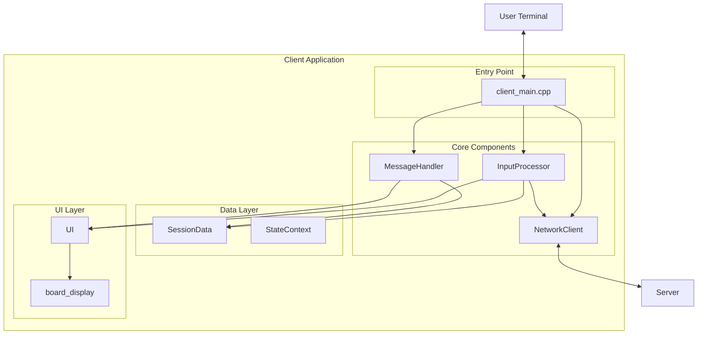

### 2.2 Data Flow

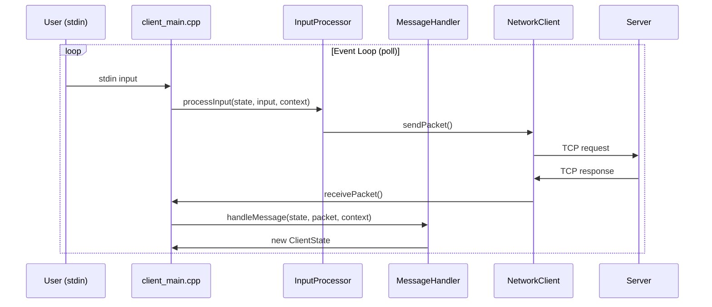

---

## 3. Chi Tiết Các Module

### 3.1 client_main.cpp

**Vai trò:** Entry point và main event loop của ứng dụng.

#### Luồng hoạt động chính:

```cpp
int main() {
    // 1. Khởi tạo components
    NetworkClient &network = NetworkClient::getInstance();
    MessageHandler messageHandler;
    InputProcessor inputProcessor;
    
    // 2. Cấu hình terminal (non-blocking, raw mode)
    // 3. Setup poll() với 2 file descriptors:
    //    - fds[0]: STDIN_FILENO (user input)
    //    - fds[1]: socket_fd (server messages)
    
    // 4. Main event loop
    while (currentState != ClientState::EXITING) {
        poll(fds, 2, 10);  // 10ms timeout
        
        // Xử lý stdin
        if (fds[0].revents & POLLIN) {
            currentState = inputProcessor.processInput(...);
        }
        
        // Xử lý socket
        if (fds[1].revents & POLLIN) {
            while (network.receivePacket(packet) == 1) {
                currentState = messageHandler.handleMessage(...);
            }
        }
    }
}
```

#### Key Functions:

| Hàm | Mô tả |
|-----|-------|
| `signalHandler()` | Xử lý SIGINT (Ctrl+C) để thoát gracefully |
| `cleanupTerminal()` | Khôi phục terminal settings khi thoát |
| `readLineNonBlocking()` | Đọc input từ stdin (non-blocking) với xử lý backspace |

---

### 3.2 client_state.hpp

**Vai trò:** Định nghĩa tất cả các trạng thái của client và context data.

#### ClientState Enum

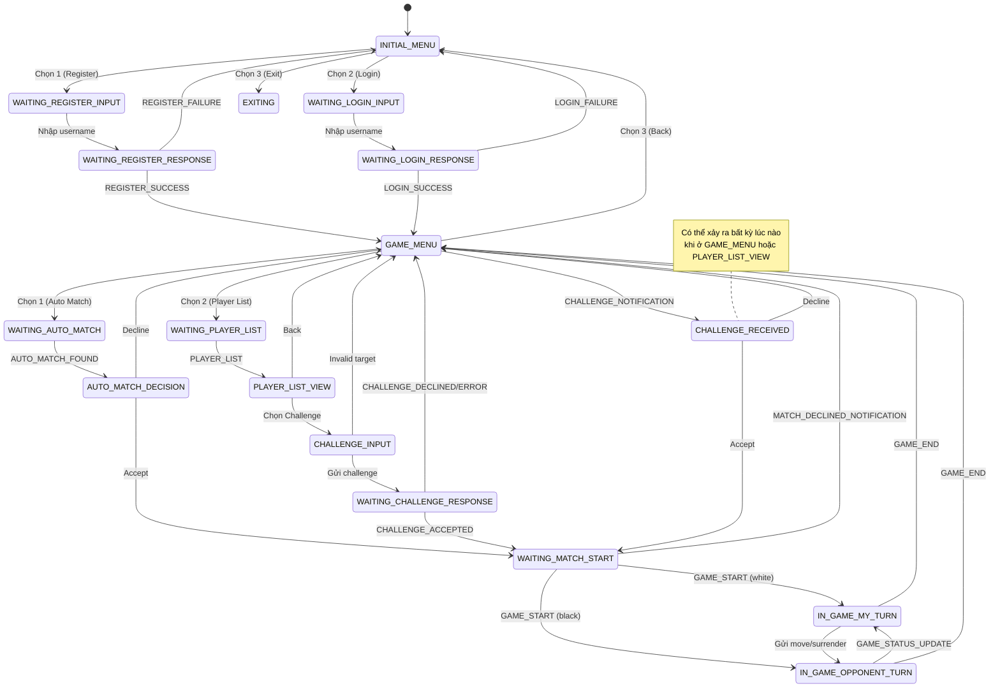

#### StateContext Struct

```cpp
struct StateContext {
    // Auto match data
    std::string pending_game_id;      // ID game đang chờ confirm
    std::string opponent_username;    // Tên đối thủ tìm được
    uint16_t opponent_elo;            // ELO đối thủ
    
    // Challenge data  
    std::string challenger_username;  // Tên người thách đấu
    uint16_t challenger_elo;          // ELO người thách đấu
    
    // Cache
    std::vector<PlayerListMessage::Player> player_list_cache;
    
    // Timeout tracking
    int timeout_counter;
};
```

---

### 3.3 network_client.hpp

**Vai trò:** Singleton quản lý kết nối TCP với server.

#### Thiết kế Pattern: Singleton

```cpp
class NetworkClient {
private:
    int socket_fd;
    std::vector<uint8_t> buffer;    // Buffer cho partial packets
    
    NetworkClient() {
        connectToServer(Const::SERVER_IP, Const::SERVER_PORT);
    }
    
public:
    static NetworkClient& getInstance() {
        static NetworkClient instance;
        return instance;
    }
};
```

#### Key Methods:

| Method | Return | Mô tả |
|--------|--------|-------|
| `sendPacket(type, payload)` | `bool` | Gửi packet đến server |
| `receivePacket(packet)` | `int` | 1=success, 0=no data, -1=error |
| `getSocketFd()` | `int` | Lấy socket fd cho poll() |
| `closeConnection()` | `void` | Đóng kết nối |

#### Packet Processing:

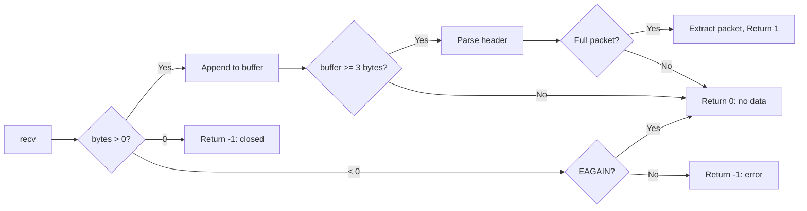

---

### 3.4 session_data.hpp

**Vai trò:** Singleton lưu trữ thông tin phiên làm việc của user.

#### Data Structure:

```cpp
struct GameStatus {
    std::string game_id = "";
    bool is_my_turn = false;
    bool is_white = false;
    std::string fen = "";
};

class SessionData {
private:
    std::string username_;
    uint16_t elo_;
    GameStatus game_status_;
};
```

#### Interface:

| Method | Mô tả |
|--------|-------|
| `getUsername()` / `setUsername()` | Quản lý username |
| `getElo()` / `setElo()` | Quản lý điểm ELO |
| `setGameStatus(game_id, is_white, fen)` | Khởi tạo game mới |
| `clearGameStatus()` | Reset sau khi game kết thúc |
| `isMyTurn()` / `setTurn()` | Quản lý lượt chơi |
| `isWhite()` | Kiểm tra màu quân |
| `getFen()` / `setFen()` | Quản lý trạng thái bàn cờ |
| `isInGame()` | Kiểm tra đang trong game |

---

### 3.5 input_processor.hpp

**Vai trò:** Xử lý tất cả input từ user dựa trên state hiện tại.

#### Main Entry Point:

```cpp
ClientState processInput(ClientState currentState, 
                         const std::string &input, 
                         StateContext &context);
```

#### Processing Methods theo State:

| State | Handler Method | Actions |
|-------|----------------|---------|
| `INITIAL_MENU` | `processInitialMenu()` | 1→Register, 2→Login, 3→Exit |
| `WAITING_REGISTER_INPUT` | `processRegisterInput()` | Validate & send RegisterMessage |
| `WAITING_LOGIN_INPUT` | `processLoginInput()` | Validate & send LoginMessage |
| `GAME_MENU` | `processGameMenu()` | 1→AutoMatch, 2→PlayerList, 3→Back |
| `AUTO_MATCH_DECISION` | `processAutoMatchDecision()` | 1→Accept, 2→Decline |
| `PLAYER_LIST_VIEW` | `processPlayerListView()` | 1→Challenge, 2→Back |
| `CHALLENGE_INPUT` | `processChallengeInput()` | Validate target & send |
| `CHALLENGE_RECEIVED` | `processChallengeReceived()` | 1→Accept, 2→Decline |
| `IN_GAME_MY_TURN` | `processGameMove()` | Parse move/surrender |

#### Validation Flow (Challenge Input):

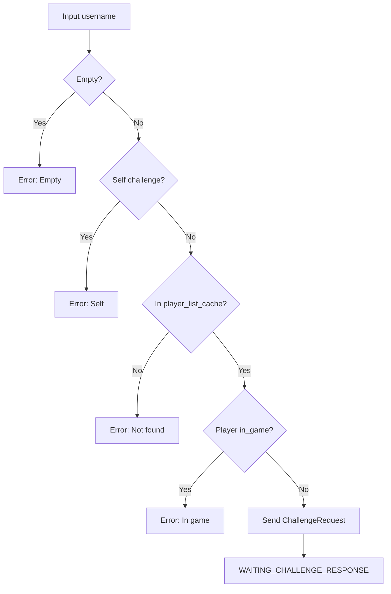

---

### 3.6 message_handler.hpp

**Vai trò:** Xử lý tất cả message từ server và cập nhật state.

#### Main Entry Point:

```cpp
ClientState handleMessage(ClientState currentState, 
                          const Packet &packet, 
                          StateContext &context);
```

#### Handler Methods:

| MessageType | Handler | Actions | Next State |
|-------------|---------|---------|------------|
| `REGISTER_SUCCESS` | `handleRegisterSuccess()` | Store username/elo, show menu | `GAME_MENU` |
| `REGISTER_FAILURE` | `handleRegisterFailure()` | Show error | `INITIAL_MENU` |
| `LOGIN_SUCCESS` | `handleLoginSuccess()` | Store username/elo, show menu | `GAME_MENU` |
| `LOGIN_FAILURE` | `handleLoginFailure()` | Show error | `INITIAL_MENU` |
| `GAME_START` | `handleGameStart()` | Init game, show board | `IN_GAME_MY_TURN` or `IN_GAME_OPPONENT_TURN` |
| `GAME_STATUS_UPDATE` | `handleGameStatusUpdate()` | Update FEN, show board | `IN_GAME_MY_TURN` or `IN_GAME_OPPONENT_TURN` |
| `INVALID_MOVE` | `handleInvalidMove()` | Show error | `IN_GAME_MY_TURN` |
| `GAME_END` | `handleGameEnd()` | Clear game, show result | `GAME_MENU` |
| `AUTO_MATCH_FOUND` | `handleAutoMatchFound()` | Store opponent info | `AUTO_MATCH_DECISION` |
| `MATCH_DECLINED_NOTIFICATION` | `handleMatchDeclinedNotification()` | Show info | `GAME_MENU` |
| `PLAYER_LIST` | `handlePlayerList()` | Cache players, display | `PLAYER_LIST_VIEW` |
| `CHALLENGE_NOTIFICATION` | `handleChallengeNotification()` | Store challenger | `CHALLENGE_RECEIVED` |
| `CHALLENGE_ACCEPTED` | `handleChallengeAccepted()` | Show info | `WAITING_MATCH_START` |
| `CHALLENGE_DECLINED` | `handleChallengeDeclined()` | Show info | `GAME_MENU` |
| `CHALLENGE_ERROR` | `handleChallengeError()` | Show error | `GAME_MENU` |

---

### 3.7 ui.hpp

**Vai trò:** Namespace chứa tất cả các hàm hiển thị UI.

#### ANSI Color Codes:

```cpp
#define RESET  "\033[0m"
#define CYAN   "\033[96m"   // Info messages
#define RED    "\033[31m"   // Error messages
#define GREEN  "\033[32m"   // Success messages
#define YELLOW "\033[33m"   // Warnings
#define BLUE   "\033[34m"   // Decorations
```

#### UI Functions:

| Category | Functions |
|----------|-----------|
| **Display Control** | `clearConsole()`, `printLogo()` |
| **Messages** | `printErrorMessage()`, `printSuccessMessage()`, `printInfoMessage()` |
| **Menus** | `displayInitialMenuPrompt()`, `displayGameMenuPrompt()` |
| **Auth** | `displayRegisterPrompt()`, `displayLoginPrompt()` |
| **Matchmaking** | `displayAutoMatchOptionsPrompt()`, `displayWaitingAutoMatch()` |
| **Challenge** | `displayPlayerList()`, `displayChallengeInputPrompt()`, `displayChallengeDecisionPrompt()`, `displayWaitingChallengeResponse()` |
| **Game** | `displayGameStart()`, `displayGameEnd()`, `displayMovePrompt()`, `displayWaitingOpponentMove()`, `showBoard()` |

---

### 3.8 board_display.hpp

**Vai trò:** Namespace hiển thị bàn cờ ASCII với colors.

#### Key Functions:

```cpp
// Render bàn cờ từ FEN string
void printBoard(const std::string &fen, bool flip);

// Render một dòng của bàn cờ
void printLine(int iLine, const char *pchColor1, 
               const char *pchColor2, const chess::Board &board, bool flip);
```

#### Board Rendering:

- Sử dụng `chess::Board` từ chess_engine để parse FEN
- Hỗ trợ flip board cho người chơi quân đen
- Màu quân: Cyan (WHITE), Red (BLACK)
- Ô vuông: Light gray (WHITE), Dark gray (BLACK)

---

## 4. State Machine Chi Tiết

### 4.1 Bảng States

| State | Category | Accepts Input? | Description |
|-------|----------|----------------|-------------|
| `INITIAL_MENU` | Menu | ✅ | Menu chọn Register/Login/Exit |
| `WAITING_REGISTER_INPUT` | Auth | ✅ | Chờ nhập username để đăng ký |
| `WAITING_LOGIN_INPUT` | Auth | ✅ | Chờ nhập username để đăng nhập |
| `WAITING_REGISTER_RESPONSE` | Waiting | ❌ | Đang chờ server xác nhận đăng ký |
| `WAITING_LOGIN_RESPONSE` | Waiting | ❌ | Đang chờ server xác nhận đăng nhập |
| `GAME_MENU` | Menu | ✅ | Menu chính sau khi login |
| `WAITING_AUTO_MATCH` | Waiting | ❌ | Đang chờ tìm đối thủ |
| `AUTO_MATCH_DECISION` | Decision | ✅ | Chọn Accept/Decline trận đấu |
| `WAITING_MATCH_START` | Waiting | ❌ | Đang chờ game start |
| `WAITING_PLAYER_LIST` | Waiting | ❌ | Đang tải danh sách |
| `PLAYER_LIST_VIEW` | Menu | ✅ | Xem danh sách người chơi |
| `CHALLENGE_INPUT` | Input | ✅ | Nhập tên người thách đấu |
| `WAITING_CHALLENGE_RESPONSE` | Waiting | ❌ | Chờ đối thủ phản hồi |
| `CHALLENGE_RECEIVED` | Decision | ✅ | Nhận thách đấu, chọn phản hồi |
| `IN_GAME_MY_TURN` | Game | ✅ | Lượt đi của mình |
| `IN_GAME_OPPONENT_TURN` | Game | ❌ | Chờ đối thủ |
| `EXITING` | Exit | ❌ | Đang thoát |

---

## 5. Luồng Xử Lý Theo Case

### 5.1 Case: Đăng Ký Tài Khoản

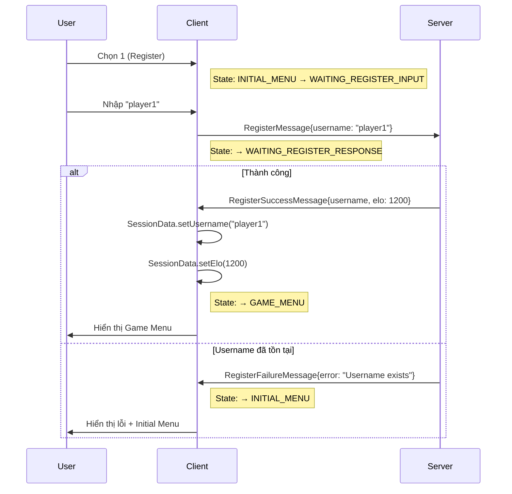

**Function Call Chain:**
```
main() 
  └─> InputProcessor::processInput()
        └─> processInitialMenu() [input = "1"]
              └─> Return WAITING_REGISTER_INPUT
  └─> InputProcessor::processInput()
        └─> processRegisterInput() [input = "player1"]
              ├─> RegisterMessage.serialize()
              ├─> NetworkClient::sendPacket()
              └─> Return WAITING_REGISTER_RESPONSE
  └─> MessageHandler::handleMessage()
        └─> handleRegisterSuccess() / handleRegisterFailure()
              ├─> SessionData::setUsername()
              ├─> SessionData::setElo()
              ├─> UI::displayGameMenuPrompt()
              └─> Return GAME_MENU or INITIAL_MENU
```

---

### 5.2 Case: Auto Match Flow

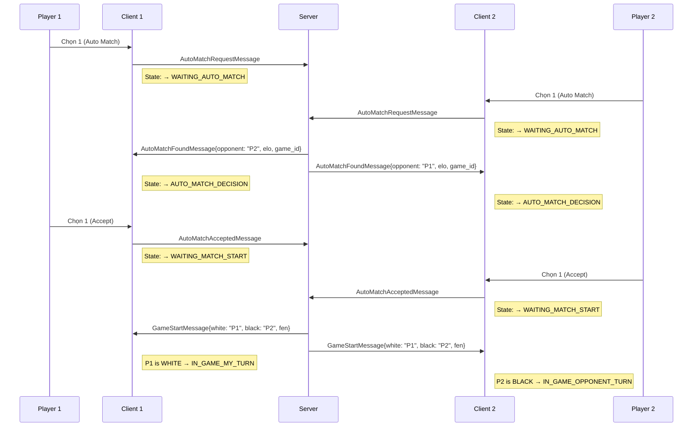

**Function Call Chain (Accept Path):**
```
InputProcessor::processGameMenu() [input = "1"]
  ├─> AutoMatchRequestMessage.serialize()
  ├─> NetworkClient::sendPacket()
  └─> Return WAITING_AUTO_MATCH

MessageHandler::handleAutoMatchFound()
  ├─> AutoMatchFoundMessage::deserialize()
  ├─> context.pending_game_id = game_id
  ├─> context.opponent_username = opponent
  ├─> context.opponent_elo = elo
  ├─> UI::displayAutoMatchOptionsPrompt()
  └─> Return AUTO_MATCH_DECISION

InputProcessor::processAutoMatchDecision() [input = "1"]
  ├─> AutoMatchAcceptedMessage.serialize()
  ├─> NetworkClient::sendPacket()
  └─> Return WAITING_MATCH_START

MessageHandler::handleGameStart()
  ├─> GameStartMessage::deserialize()
  ├─> SessionData::setGameStatus(game_id, is_white, fen)
  ├─> UI::showBoard(fen, flip)
  └─> Return IN_GAME_MY_TURN or IN_GAME_OPPONENT_TURN
```

---

### 5.3 Case: Challenge Flow

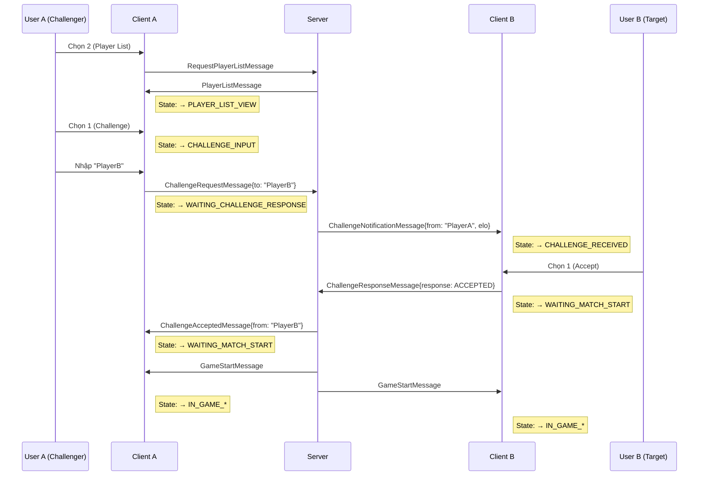

---

### 5.4 Case: Game Play Flow

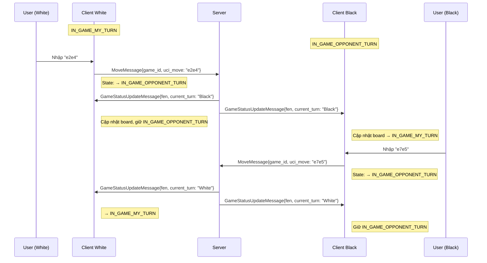

**Function Call Chain (Move):**
```
InputProcessor::processGameMove() [input = "e2e4"]
  ├─> Validate move format (4-5 chars)
  ├─> MoveMessage{game_id: SessionData.getGameId(), uci_move: "e2e4"}
  ├─> NetworkClient::sendPacket()
  └─> Return IN_GAME_OPPONENT_TURN

MessageHandler::handleGameStatusUpdate()
  ├─> GameStatusUpdateMessage::deserialize()
  ├─> SessionData::setFen(new_fen)
  ├─> is_my_turn = (current_turn == my_username)
  ├─> SessionData::setTurn(is_my_turn)
  ├─> UI::showBoard(fen, flip)
  └─> Return IN_GAME_MY_TURN or IN_GAME_OPPONENT_TURN
```

---

### 5.5 Case: Surrender Flow

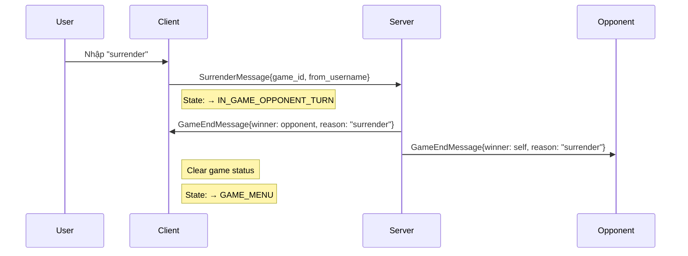

**Function Call:**
```cpp
// In processGameMove()
if (input == "surrender" || input == "gg" || input == "quit") {
    SurrenderMessage msg;
    msg.game_id = session_.getGameId();
    msg.from_username = session_.getUsername();
    network_.sendPacket(msg.getType(), msg.serialize());
    return ClientState::IN_GAME_OPPONENT_TURN;
}
```

---

### 5.6 Case: Invalid Move

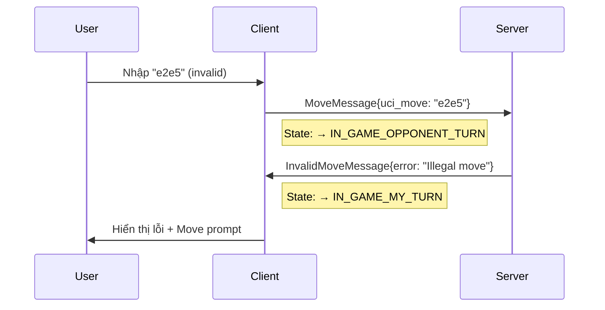

---

## 6. Giao Thức Mạng

### 6.1 Packet Format

```
+---------+-----------+------------------+
|  type   |  length   |     payload      |
| 1 byte  |  2 bytes  |   length bytes   |
+---------+-----------+------------------+
```

- **type**: `MessageType` enum (uint8_t)
- **length**: Payload length in Big Endian (uint16_t)
- **payload**: Variable length data

### 6.2 Message Types (Client-relevant)

#### Client → Server:

| Code | Name | Payload |
|------|------|---------|
| 0x10 | REGISTER | `[len][username]` |
| 0x20 | LOGIN | `[len][username]` |
| 0x30 | REQUEST_PLAYER_LIST | (empty) |
| 0x41 | MOVE | `[len][game_id][len][uci_move]` |
| 0x45 | SURRENDER | `[len][game_id][len][username]` |
| 0x50 | CHALLENGE_REQUEST | `[len][to_username]` |
| 0x52 | CHALLENGE_RESPONSE | `[len][from_username][response]` |
| 0x55 | AUTO_MATCH_REQUEST | `[len][username]` |
| 0x57 | AUTO_MATCH_ACCEPTED | `[len][game_id]` |
| 0x58 | AUTO_MATCH_DECLINED | `[len][game_id]` |

#### Server → Client:

| Code | Name | Payload |
|------|------|---------|
| 0x11 | REGISTER_SUCCESS | `[len][username][elo:2]` |
| 0x12 | REGISTER_FAILURE | `[len][error_msg]` |
| 0x21 | LOGIN_SUCCESS | `[len][username][elo:2]` |
| 0x22 | LOGIN_FAILURE | `[len][error_msg]` |
| 0x31 | PLAYER_LIST | `[count][...players...]` |
| 0x40 | GAME_START | `[len][game_id][len][p1][len][p2][len][start][len][fen]` |
| 0x42 | INVALID_MOVE | `[len][game_id][len][error]` |
| 0x43 | GAME_STATUS_UPDATE | `[len][game_id][len][fen][len][turn][is_over][len][msg]` |
| 0x44 | GAME_END | `[len][game_id][len][winner][len][reason][moves:2]` |
| 0x51 | CHALLENGE_NOTIFICATION | `[len][from][elo:2]` |
| 0x53 | CHALLENGE_ACCEPTED | `[len][from][len][game_id]` |
| 0x54 | CHALLENGE_DECLINED | `[len][from]` |
| 0x56 | AUTO_MATCH_FOUND | `[len][opponent][elo:2][len][game_id]` |
| 0x59 | MATCH_DECLINED_NOTIFICATION | `[len][game_id]` |
| 0x5B | CHALLENGE_ERROR | `[len][error_msg]` |

---

## 7. Diagrams

### 7.1 Component Interaction Diagram

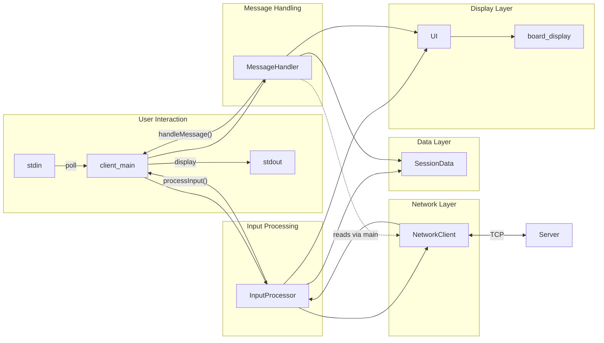

### 7.2 Full State Transition Table

| From State | Event/Input | To State | Actions |
|------------|-------------|----------|---------|
| INITIAL_MENU | "1" | WAITING_REGISTER_INPUT | Display register prompt |
| INITIAL_MENU | "2" | WAITING_LOGIN_INPUT | Display login prompt |
| INITIAL_MENU | "3" | EXITING | Print goodbye |
| WAITING_REGISTER_INPUT | username | WAITING_REGISTER_RESPONSE | Send RegisterMessage |
| WAITING_LOGIN_INPUT | username | WAITING_LOGIN_RESPONSE | Send LoginMessage |
| WAITING_REGISTER_RESPONSE | REGISTER_SUCCESS | GAME_MENU | Store session, display menu |
| WAITING_REGISTER_RESPONSE | REGISTER_FAILURE | INITIAL_MENU | Show error |
| WAITING_LOGIN_RESPONSE | LOGIN_SUCCESS | GAME_MENU | Store session, display menu |
| WAITING_LOGIN_RESPONSE | LOGIN_FAILURE | INITIAL_MENU | Show error |
| GAME_MENU | "1" | WAITING_AUTO_MATCH | Send AutoMatchRequest |
| GAME_MENU | "2" | WAITING_PLAYER_LIST | Send RequestPlayerList |
| GAME_MENU | "3" | INITIAL_MENU | Clear, show initial menu |
| GAME_MENU | CHALLENGE_NOTIFICATION | CHALLENGE_RECEIVED | Store challenger, show prompt |
| WAITING_AUTO_MATCH | AUTO_MATCH_FOUND | AUTO_MATCH_DECISION | Store opponent, show options |
| AUTO_MATCH_DECISION | "1" (Accept) | WAITING_MATCH_START | Send AutoMatchAccepted |
| AUTO_MATCH_DECISION | "2" (Decline) | GAME_MENU | Send AutoMatchDeclined |
| WAITING_MATCH_START | GAME_START | IN_GAME_* | Init game, show board |
| WAITING_MATCH_START | MATCH_DECLINED_NOTIFICATION | GAME_MENU | Show info |
| WAITING_PLAYER_LIST | PLAYER_LIST | PLAYER_LIST_VIEW | Cache & display players |
| PLAYER_LIST_VIEW | "1" | CHALLENGE_INPUT | Show input prompt |
| PLAYER_LIST_VIEW | "2" | GAME_MENU | Clear context |
| PLAYER_LIST_VIEW | CHALLENGE_NOTIFICATION | CHALLENGE_RECEIVED | Store challenger |
| CHALLENGE_INPUT | username | WAITING_CHALLENGE_RESPONSE | Validate & send |
| CHALLENGE_INPUT | invalid | GAME_MENU | Show error |
| WAITING_CHALLENGE_RESPONSE | CHALLENGE_ACCEPTED | WAITING_MATCH_START | Show info |
| WAITING_CHALLENGE_RESPONSE | CHALLENGE_DECLINED | GAME_MENU | Show info |
| WAITING_CHALLENGE_RESPONSE | CHALLENGE_ERROR | GAME_MENU | Show error |
| CHALLENGE_RECEIVED | "1" (Accept) | WAITING_MATCH_START | Send accept response |
| CHALLENGE_RECEIVED | "2" (Decline) | GAME_MENU | Send decline response |
| IN_GAME_MY_TURN | move | IN_GAME_OPPONENT_TURN | Send MoveMessage |
| IN_GAME_MY_TURN | "surrender" | IN_GAME_OPPONENT_TURN | Send SurrenderMessage |
| IN_GAME_MY_TURN | INVALID_MOVE | IN_GAME_MY_TURN | Show error |
| IN_GAME_OPPONENT_TURN | GAME_STATUS_UPDATE (my turn) | IN_GAME_MY_TURN | Update board |
| IN_GAME_OPPONENT_TURN | GAME_STATUS_UPDATE (not my turn) | IN_GAME_OPPONENT_TURN | Update board |
| IN_GAME_* | GAME_END | GAME_MENU | Clear game, show result |

---

## Appendix: Configuration

### Constants (const.hpp)

```cpp
namespace Const {
    const uint16_t SERVER_PORT = 8088;
    const std::string SERVER_IP = "127.0.0.1";
    const uint16_t BUFFER_SIZE = 1024;
    const uint16_t DEFAULT_ELO = 1200;
    const uint16_t ELO_THRESHOLD = 300;  // For matchmaking
}
```

---

**Document Version:** 1.0  
**Last Updated:** 2024-12-28  
**Author:** Antigravity AI Assistant
